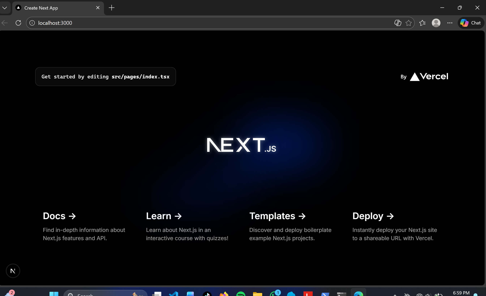
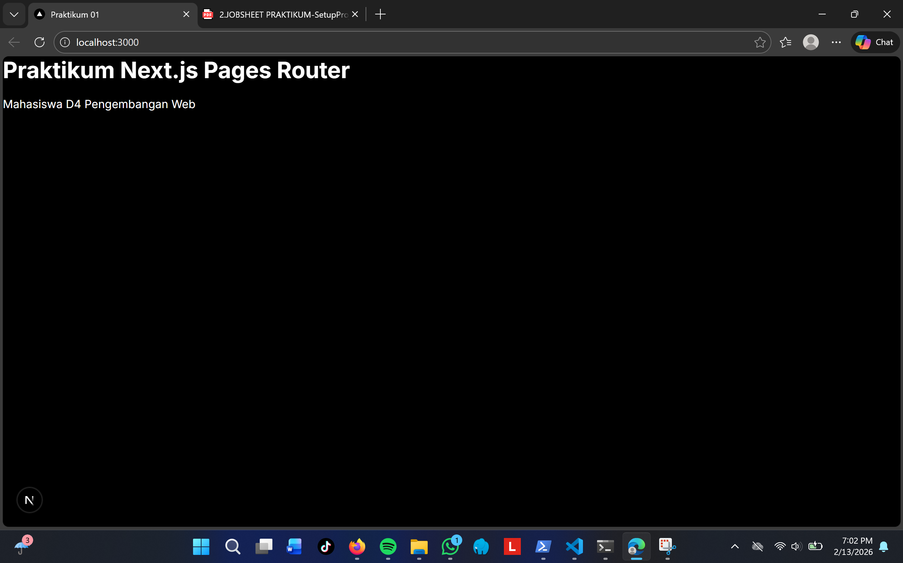
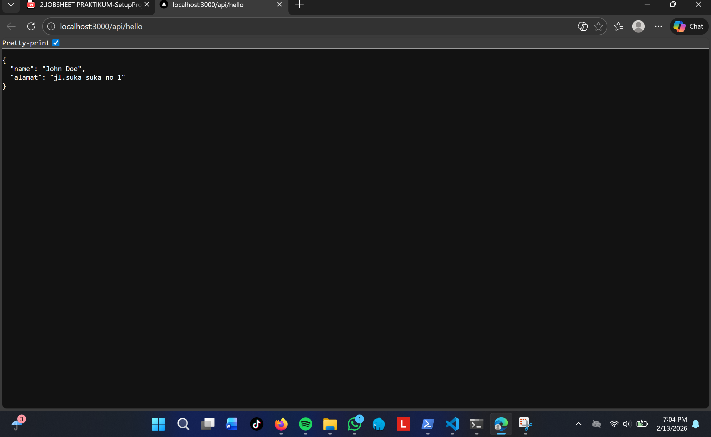
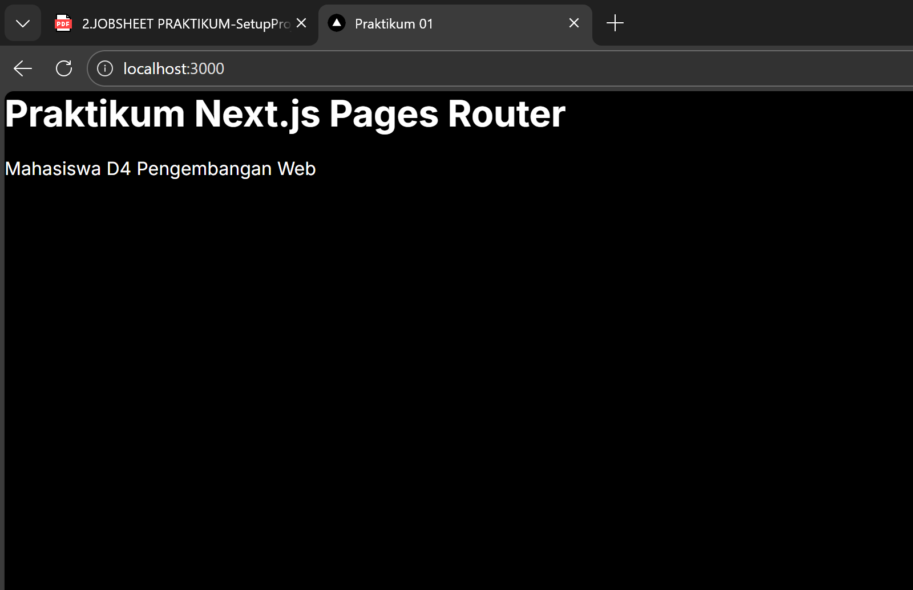
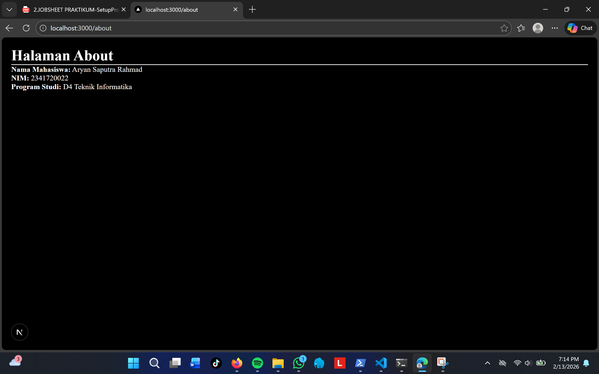
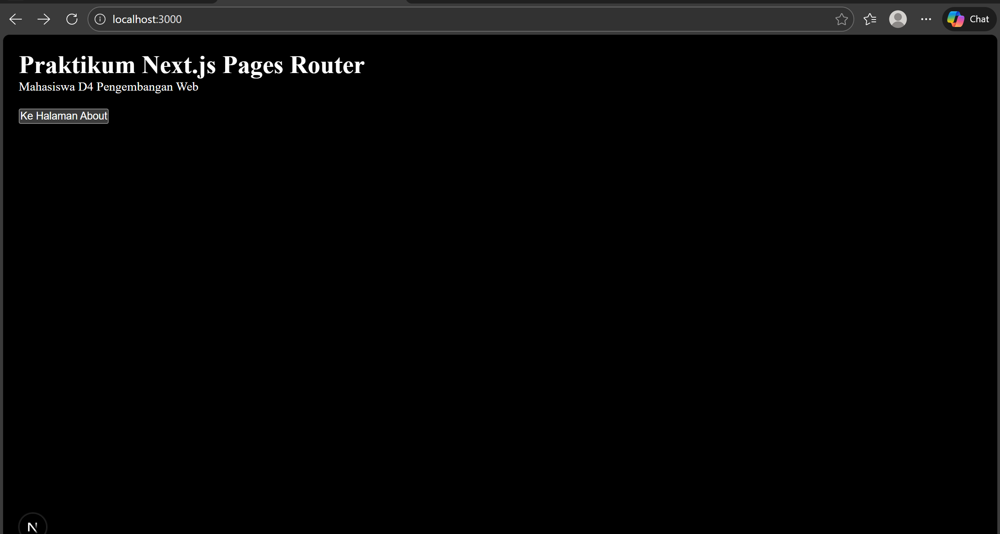

## Pertanyaan Refleksi

1. **Mengapa Pages Router disebut sebagai routing berbasis file?**
Pages Router dinamakan sebagai sistem routing berbasis file karena pembuatan URL pada aplikasi ditentukan langsung oleh susunan file dan folder yang terdapat di dalam direktori pages.
Setiap file dengan ekstensi .js, .jsx, .ts, atau .tsx yang berada di dalam folder tersebut dan mengekspor komponen React akan otomatis dikenali sebagai sebuah halaman dengan rute tertentu.
Sebagai contoh, apabila terdapat file pages/about.tsx, maka halaman tersebut dapat diakses melalui URL /about tanpa perlu konfigurasi tambahan.

2. **Apa perbedaan Next.js dengan React standar (CRA)?**

Metode Rendering:
Next.js menyediakan dukungan bawaan untuk Server-Side Rendering (SSR) dan Static Site Generation (SSG), sehingga performa dan optimasi SEO menjadi lebih baik. Sementara itu, React standar umumnya hanya menggunakan Client-Side Rendering (CSR).

Sistem Routing:
Pada Next.js, routing sudah terintegrasi secara otomatis melalui struktur folder. Sedangkan pada React standar, pengembang perlu menambahkan pustaka eksternal seperti react-router-dom untuk mengatur navigasi antar halaman.

Fitur Tambahan:
Next.js memiliki berbagai fitur siap pakai seperti API Routes, optimasi gambar, dan middleware. React standar cenderung lebih sederhana dan memerlukan konfigurasi tambahan untuk mendapatkan fitur serupa.

3. **Apa fungsi perintah npm run dev?**
menjalankan aplikasi dalam mode pengembangan (development mode).
Saat perintah ini dijalankan, sistem akan mengaktifkan server lokal (biasanya di localhost:3000) yang memungkinkan pengembang menguji aplikasi secara langsung.
Mode ini juga mendukung fitur seperti Fast Refresh atau Hot Module Replacement, sehingga setiap perubahan kode dapat langsung terlihat di browser tanpa perlu memulai ulang server.

4. **Apa perbedaan npm run dev dan run build?**
npm run dev:
Digunakan selama tahap pengembangan aplikasi.
npm run build:
Digunakan untuk menyiapkan aplikasi ke tahap produksi.

## Dokumentasi

