1. Setup
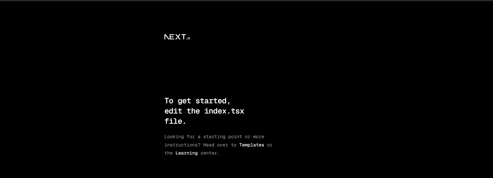

2. Membuat Catch-All Route 
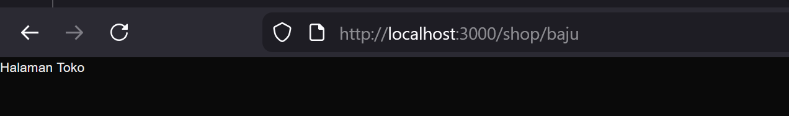
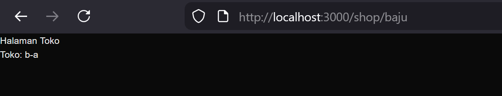

3. Membuat Catch-All Route 
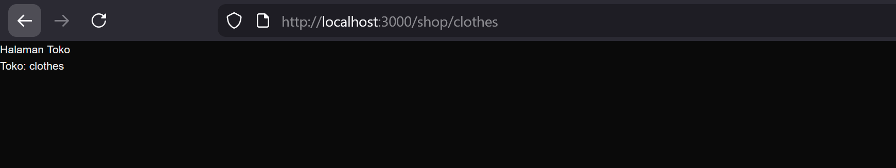
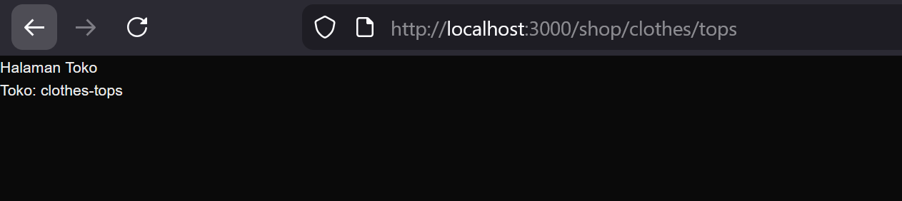
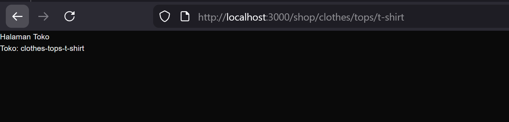

4. Optional Catch-All Route
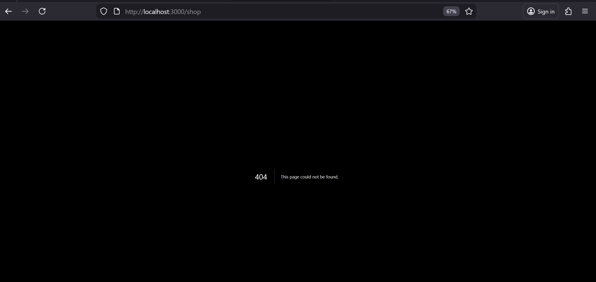
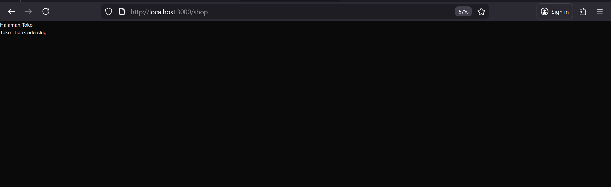

5. Validasi Parameter
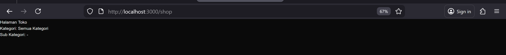

7. Navigasi Imperatif (router.push) 
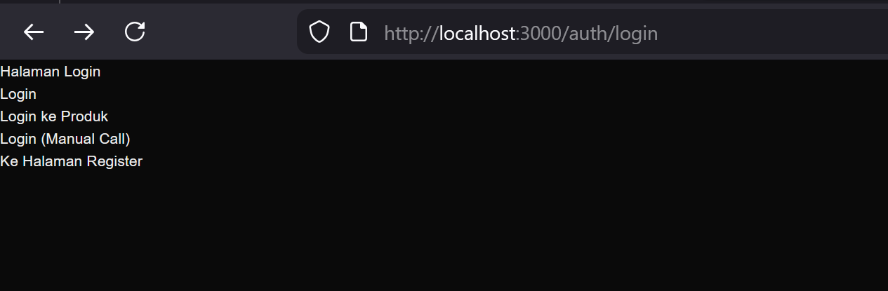
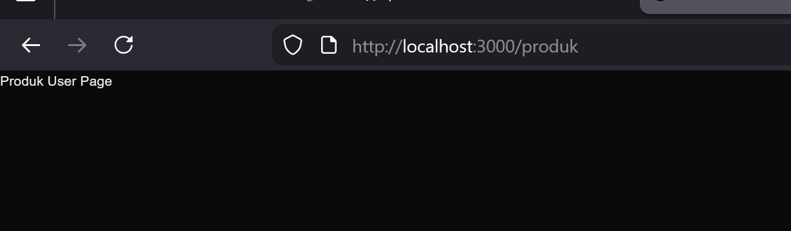

8. NavigasiSimulasi Redirect (Belum Login) 
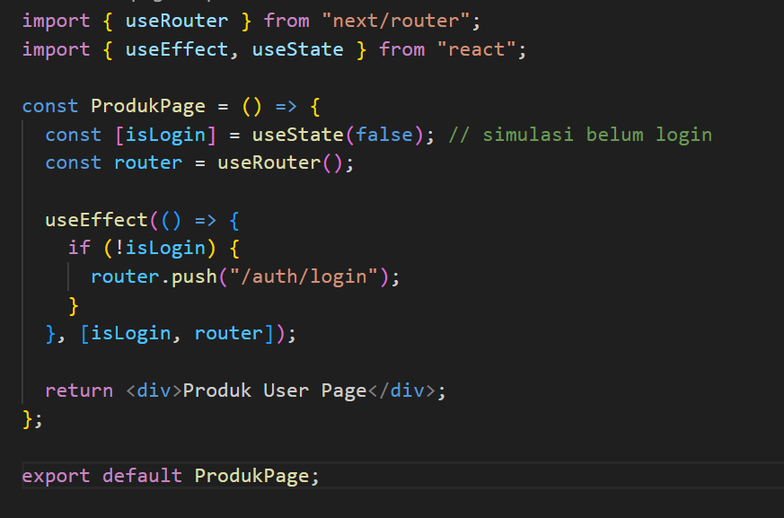

9. Tugas 1

10. Tugas 2
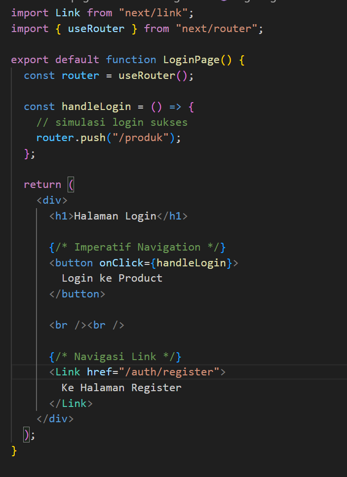
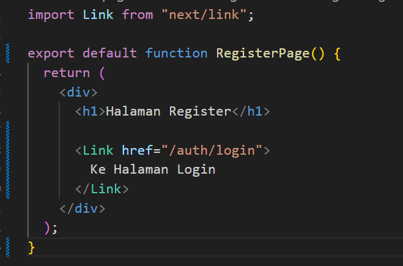
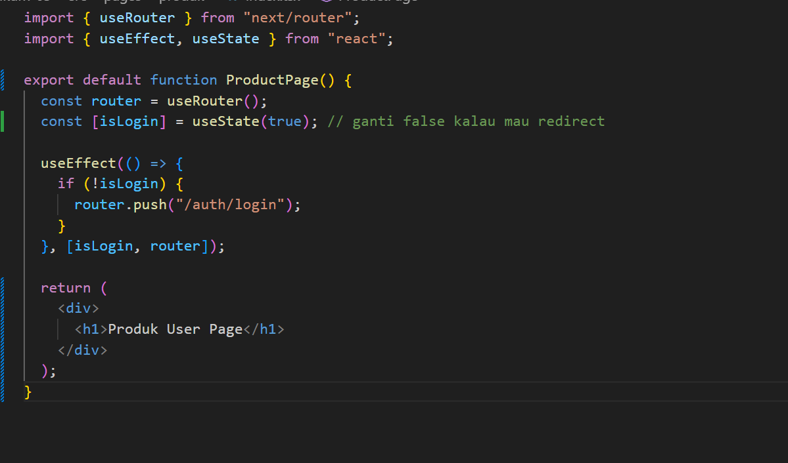

11. Tugas 3
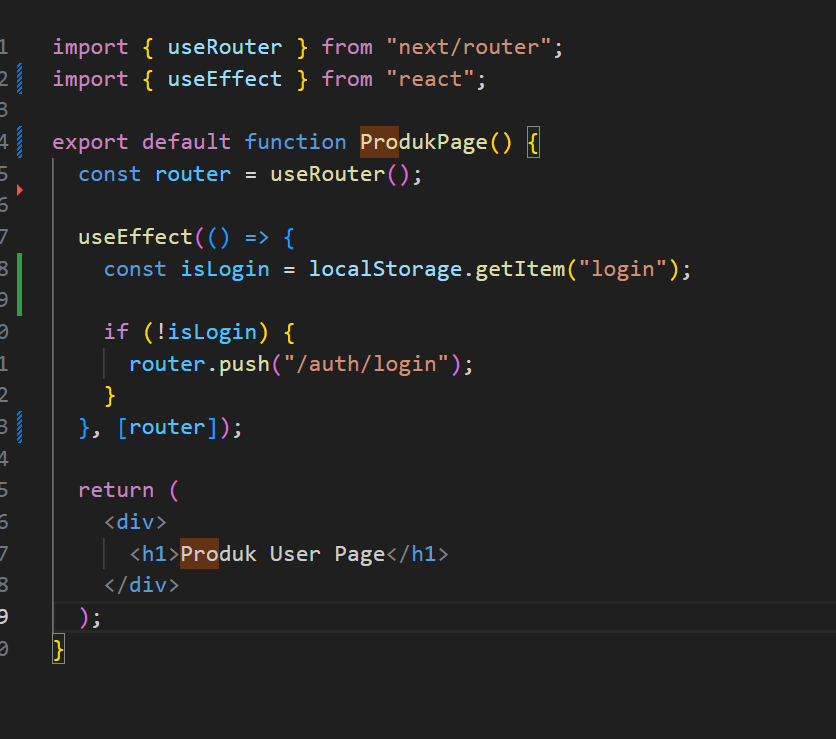
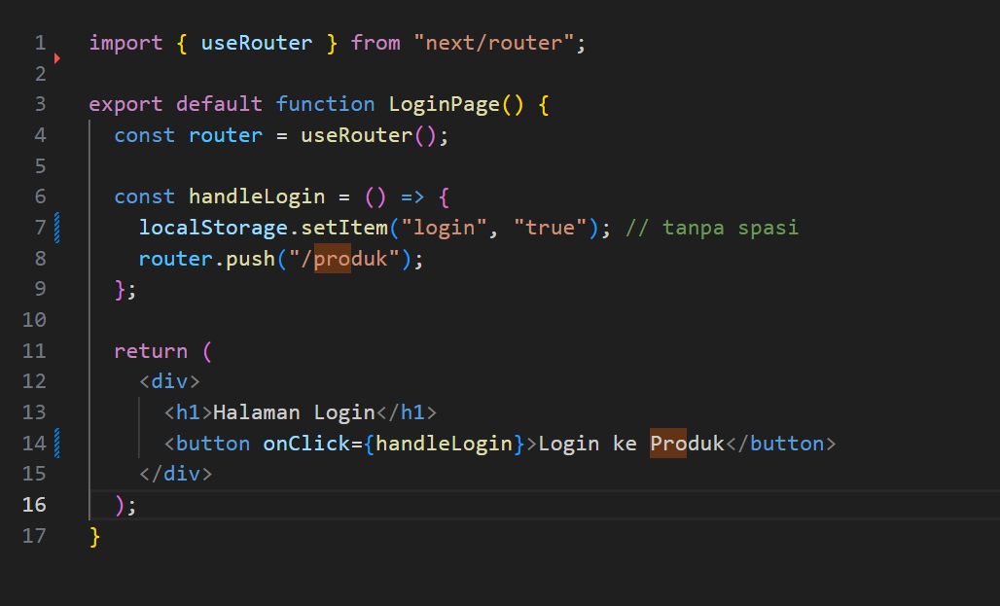

12. Tugas 4

1. Apa perbedaan [id].js dan [...slug].js? 
: File [id].js digunakan untuk menangkap satu parameter dari URL, misalnya /produk/10. Sedangkan [...slug].js digunakan untuk menangkap banyak parameter sekaligus dari URL, misalnya /produk/sepatu/nike. Jadi [id] hanya satu nilai, sedangkan [...slug] bisa banyak bagian.

2. Mengapa slug berbentuk array? 
:Karena [...slug].js bisa menangkap lebih dari satu bagian URL, maka setiap bagian disimpan sebagai array. Contohnya URL /produk/sepatu/nike akan menjadi ["sepatu", "nike"].

3. Kapan sebaiknya menggunakan Link dan router.push()? 
:Gunakan Link untuk navigasi biasa lewat klik user, seperti dari login ke register. Gunakan router.push() untuk navigasi berdasarkan proses program, misalnya setelah login berhasil langsung diarahkan ke halaman produk.

4. Mengapa navigasi Next.js tidak me-refresh halaman?
:Karena Next.js menggunakan client-side routing, yaitu hanya mengganti komponen halaman tanpa reload seluruh website. Hal ini membuat perpindahan halaman lebih cepat dan terasa seperti aplikasi mobile.