1. Global CSS

2. CSS Module (Local Scope)

3.  Styling untuk Pages (CSS Module)

4.  Conditional Rendering Navbar (Tanpa Navbar di Login)
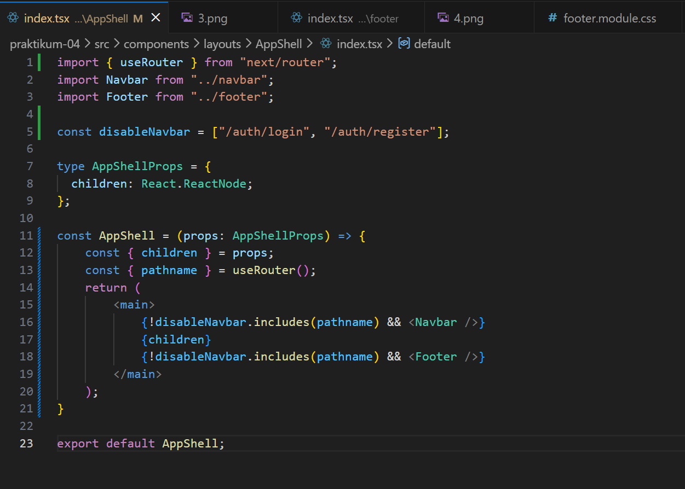
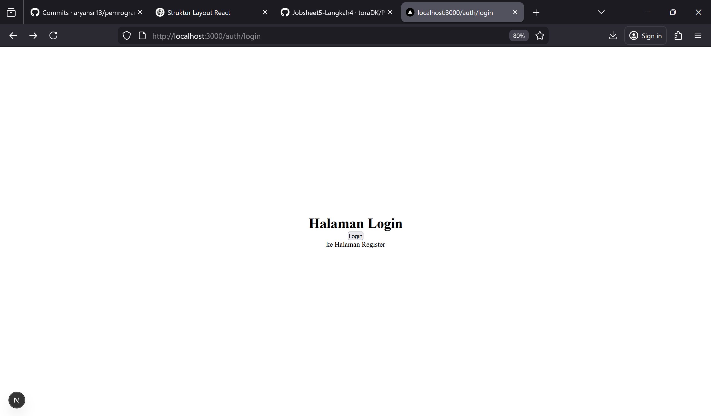

5. Refactoring Struktur
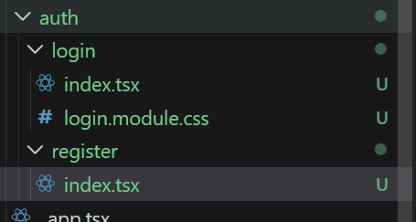
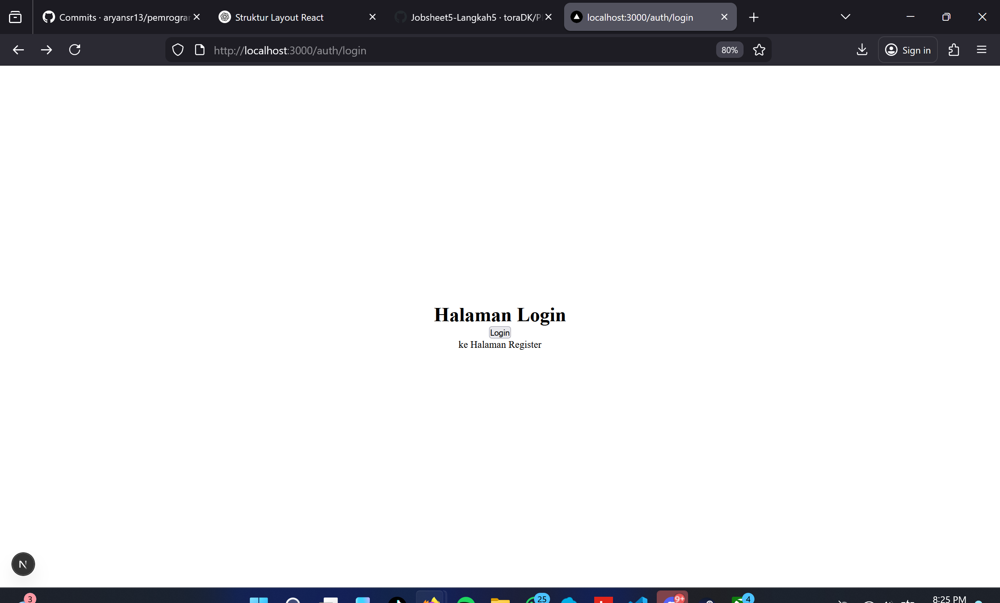

6.  Inline Styling
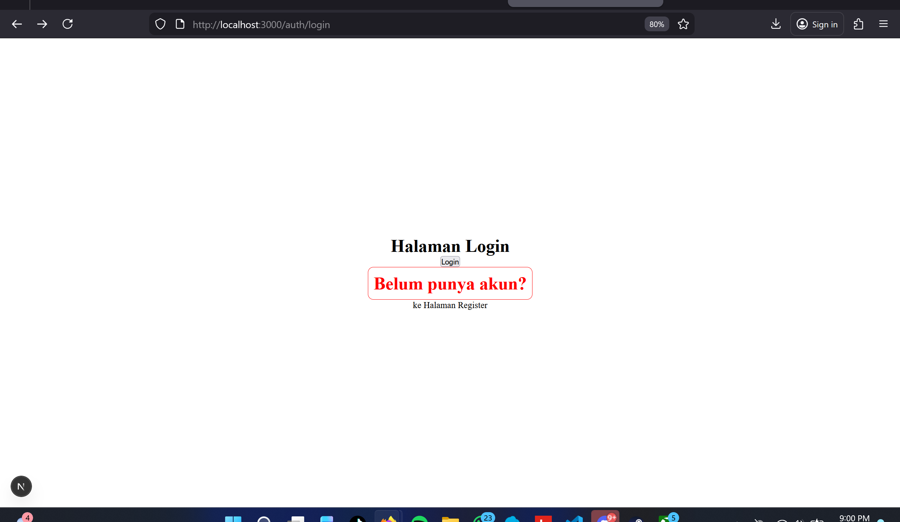
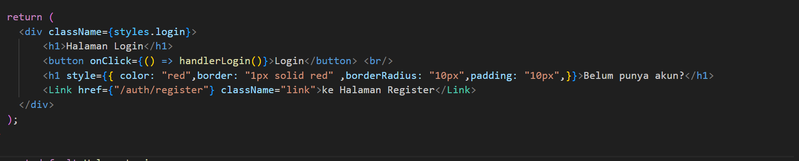

7.  Kombinasi Global CSS + CSS Module
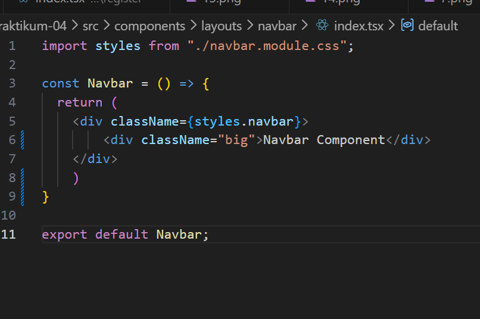
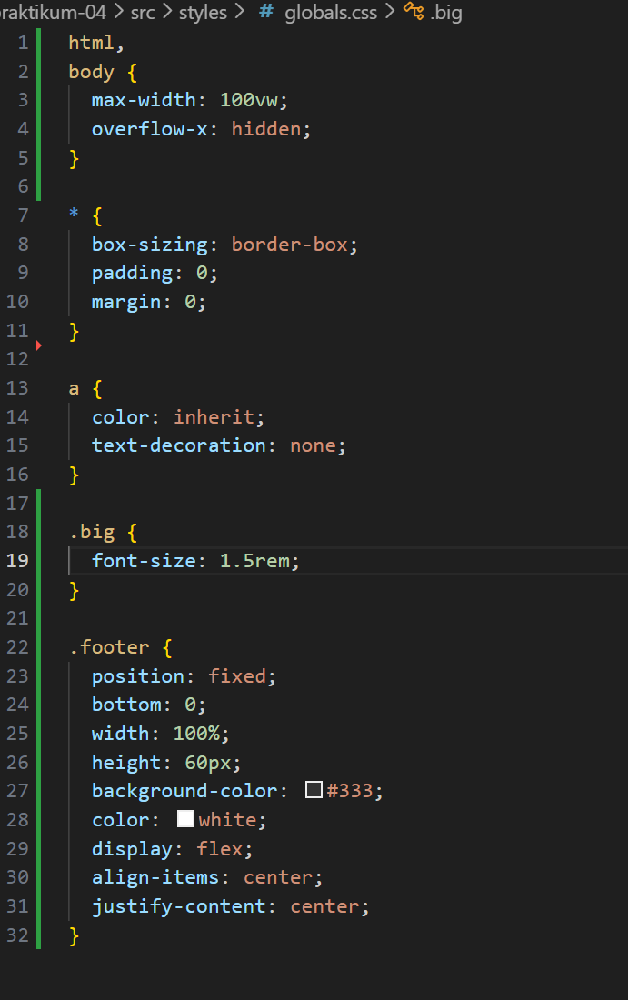

8.  SCSS (SASS)
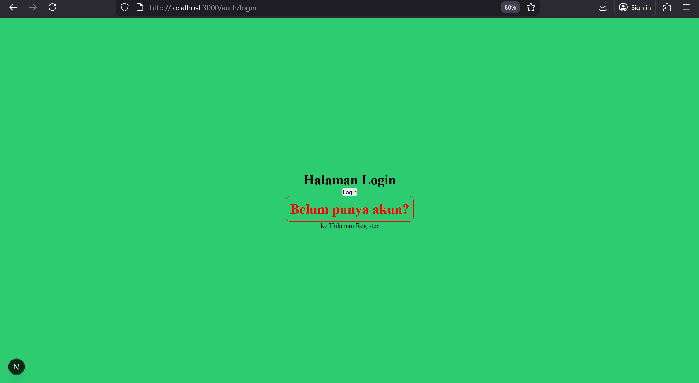
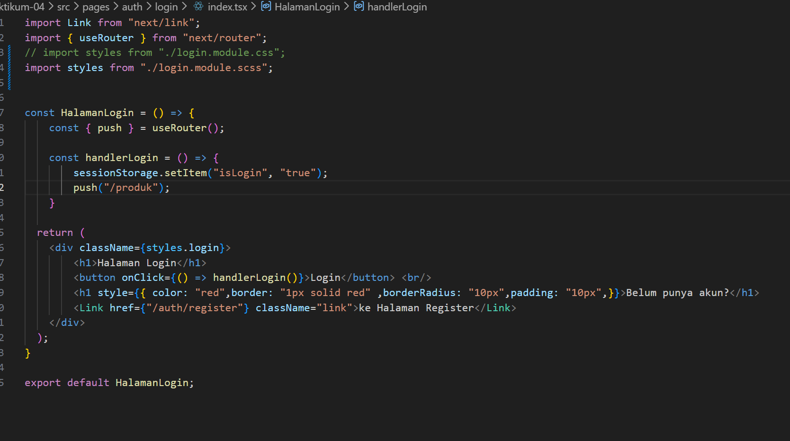
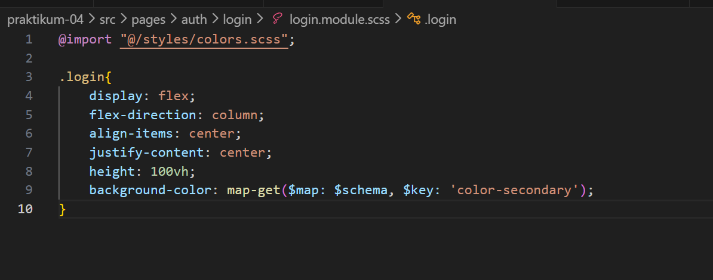
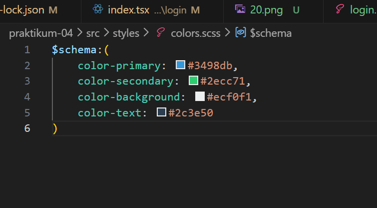

9. Tailwind CSS
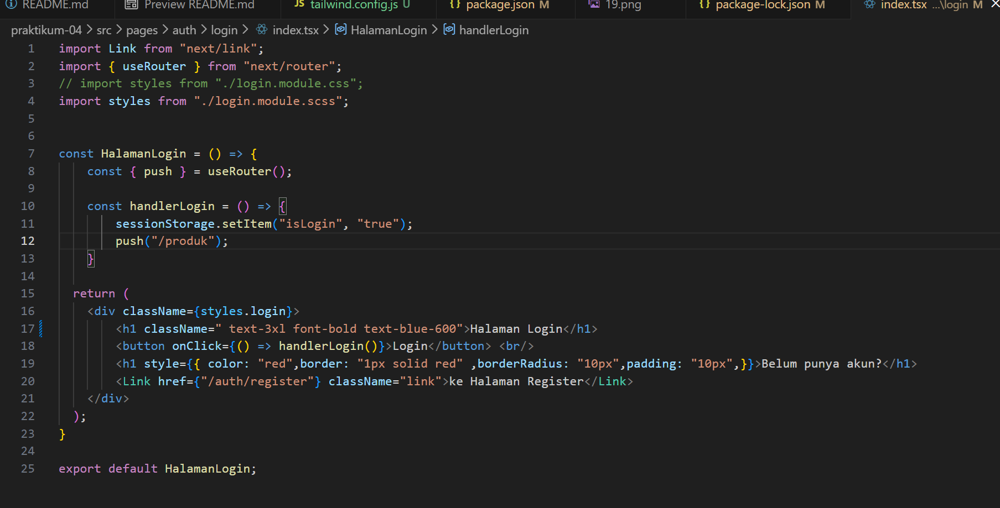
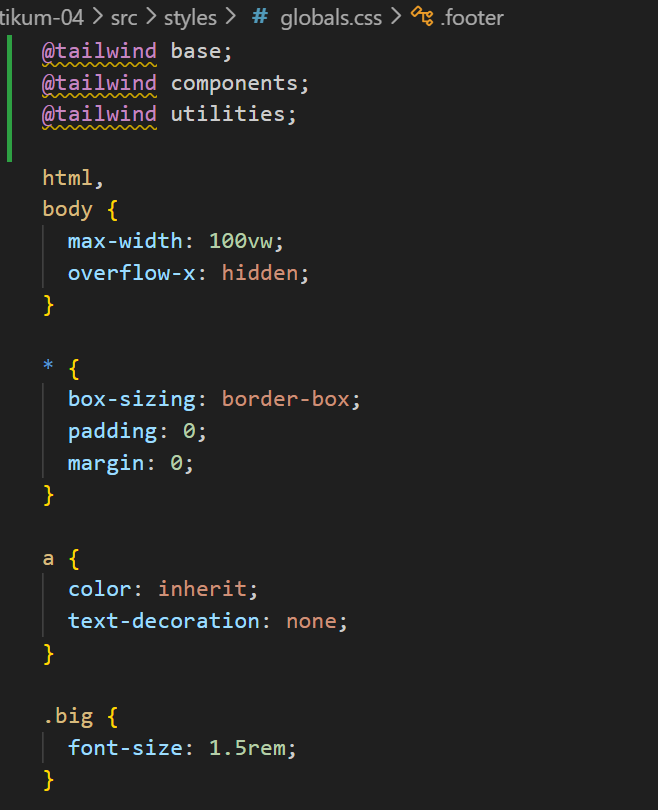
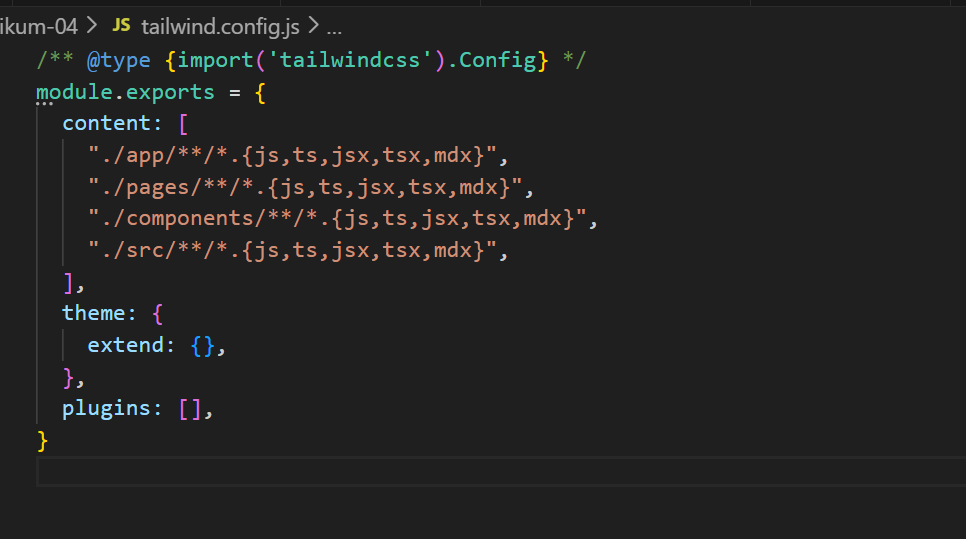
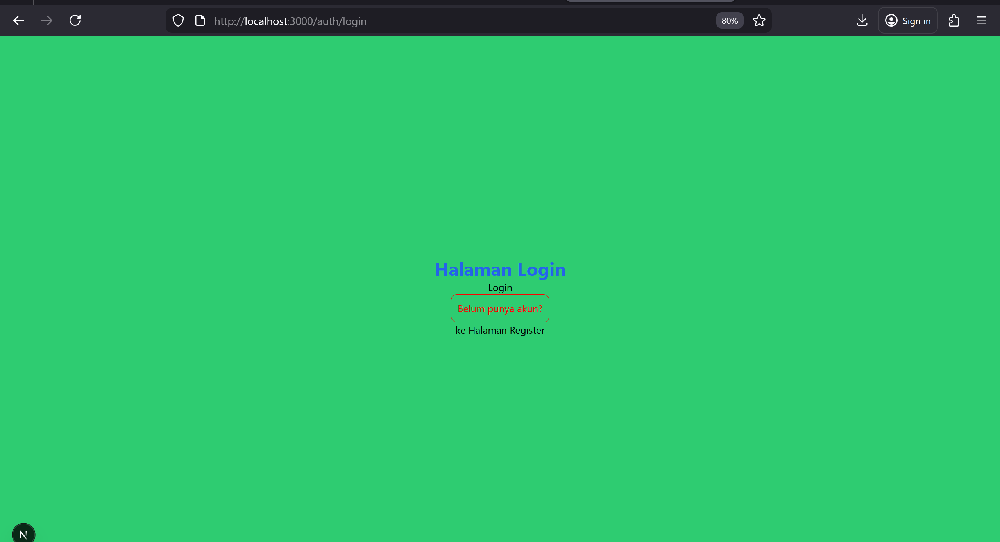