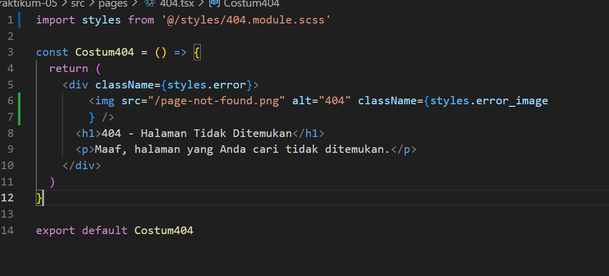
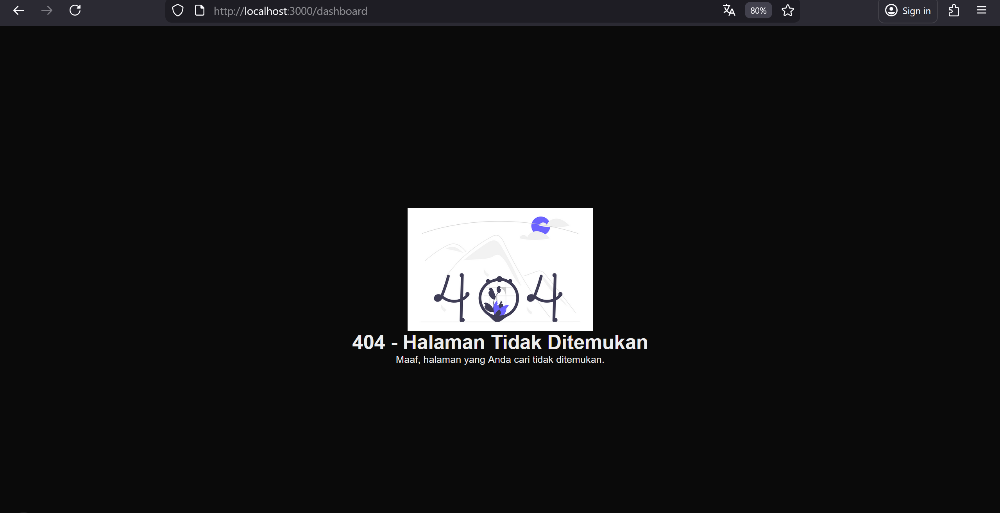
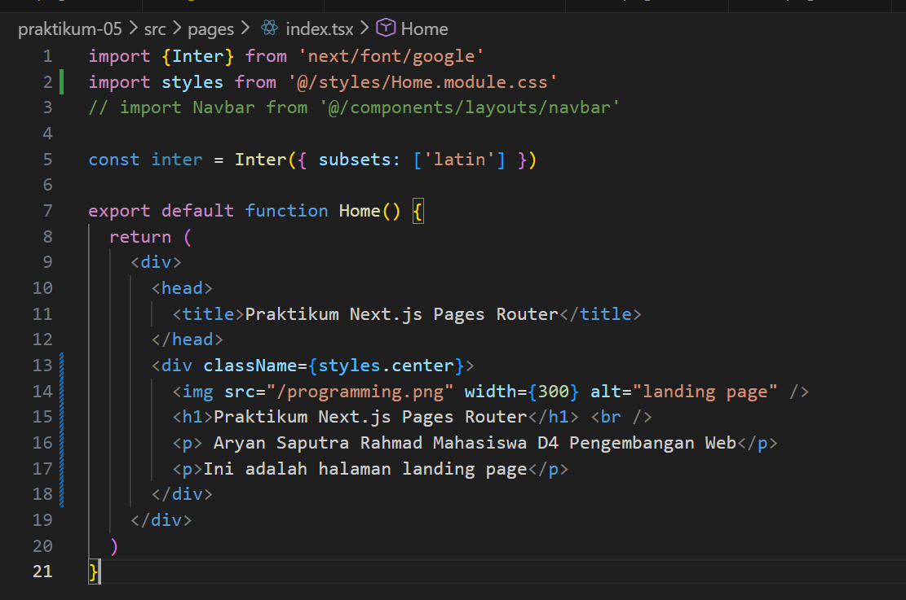
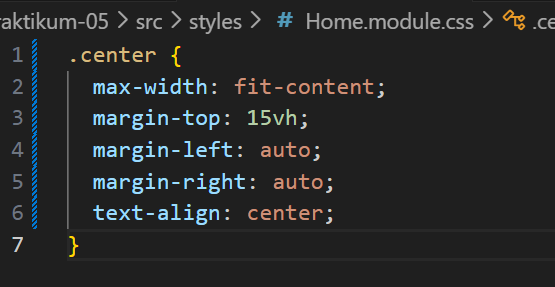
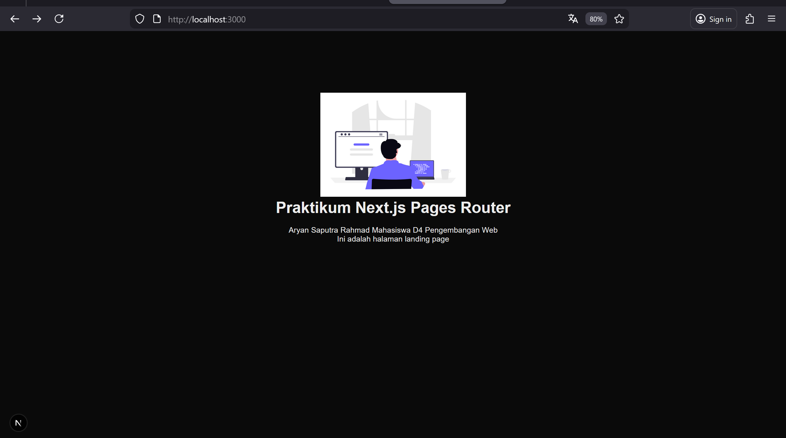
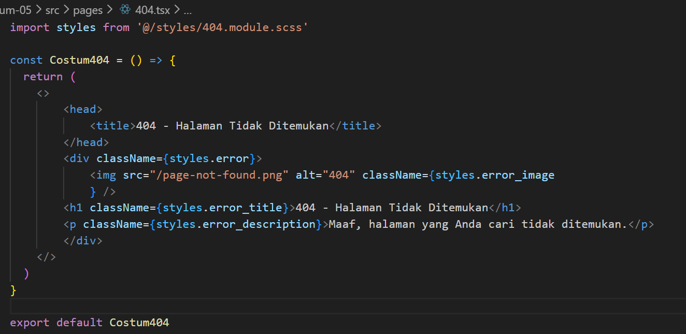
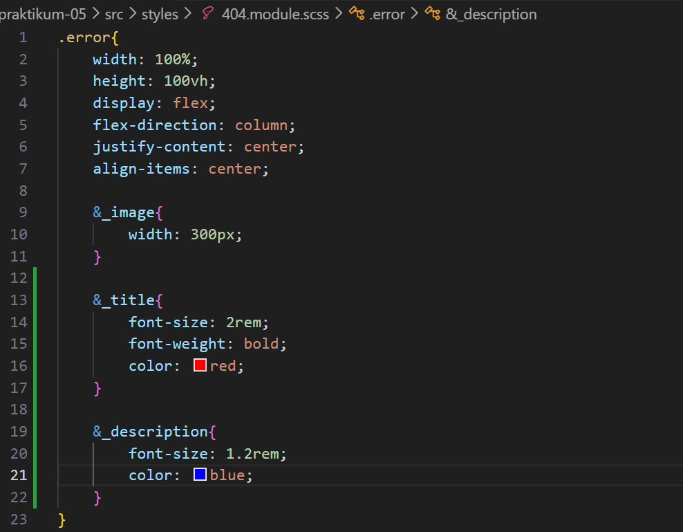
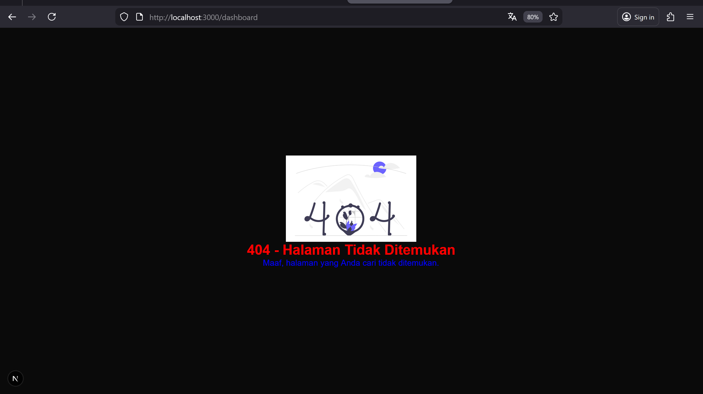
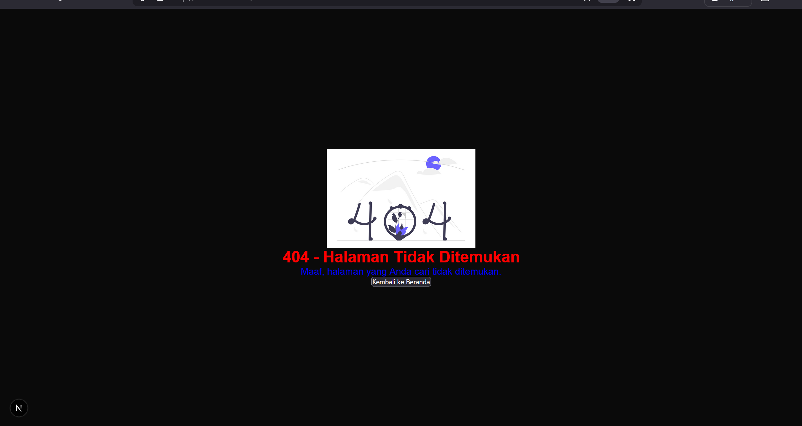
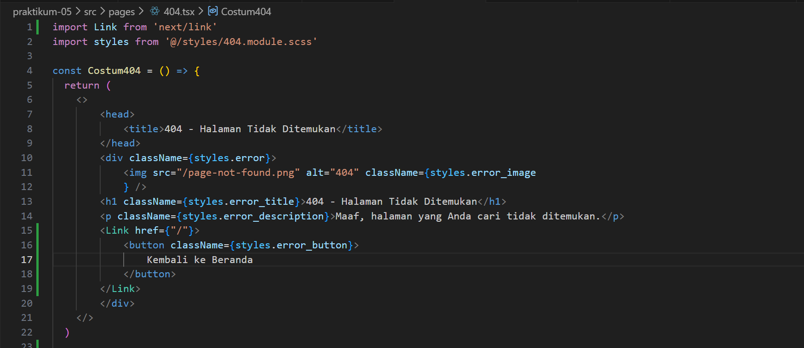

1. Menjalankan project

2.  Membuat Custom Document 

3.  Pengaturan Title per Halaman 

4.  Membuat Custom Error Page (404)

5.  Styling Halaman 404 

6. Menampilkan Gambar dari Folder Public

7. Tugas 1

8. Tugas 2

9. Tugas 3

