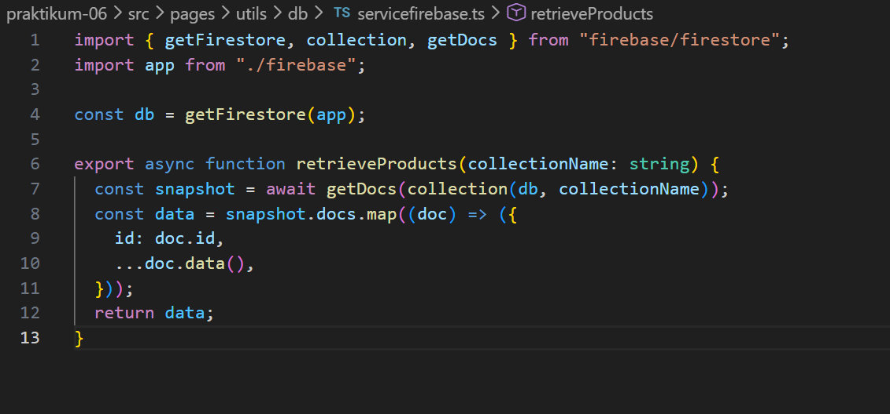
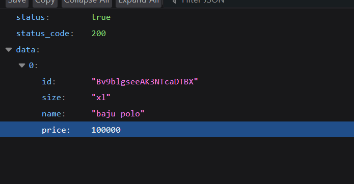
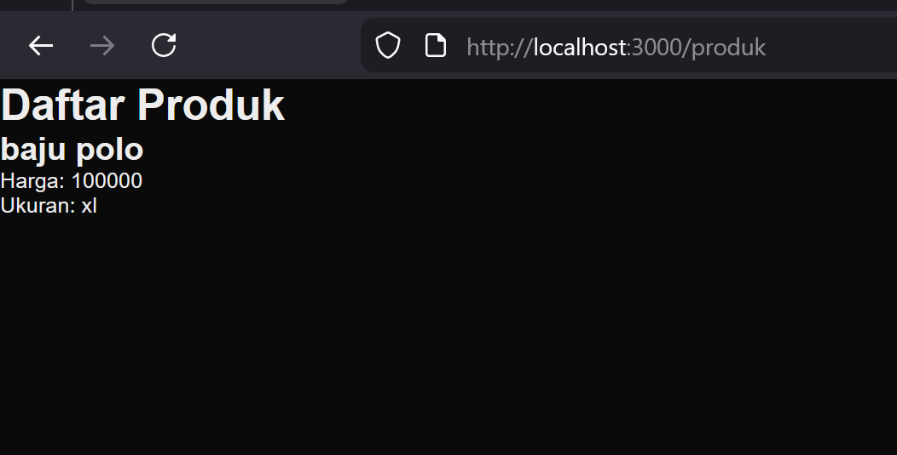
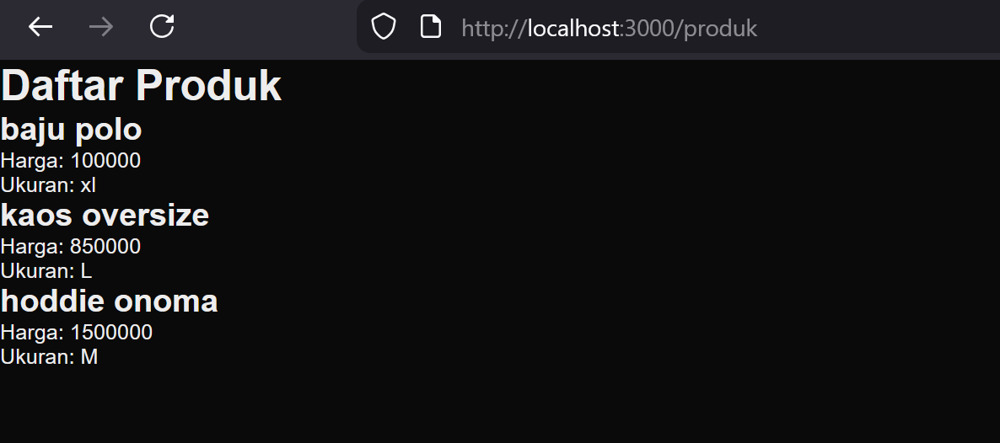
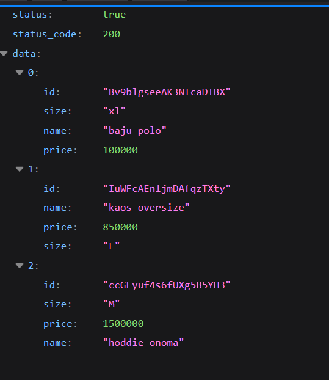
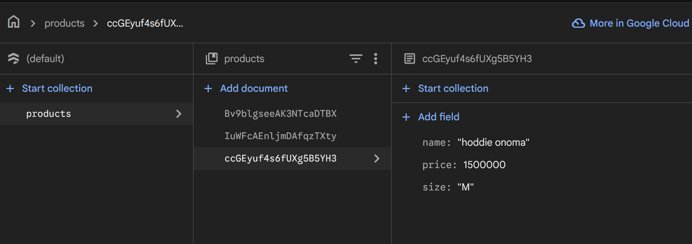
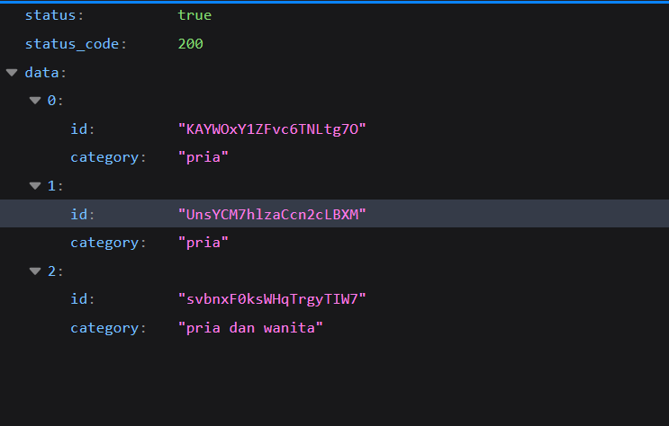
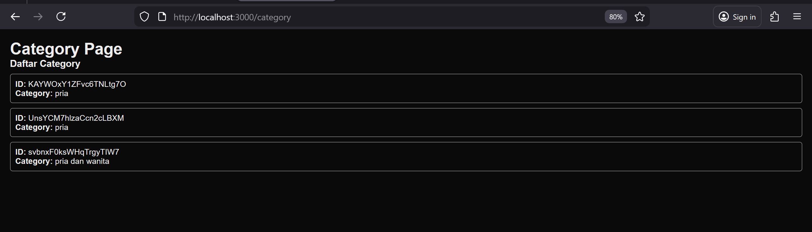
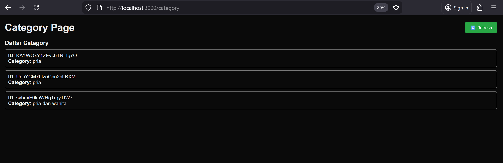

1. Menjalankan project

2.  Membuat API Produk 

3.  Fetch Data API di Frontend 

4.  setup firebase

5.  install firebase

7. 5.  firebase

8.   firebase service

9.   API Mengambil Data Firebase 

10. Tugas 1 

11.  Tugas 2

12.  Tugas 3

13. Pertanyaan Evaluasi 
1. Apa fungsi API Routes pada Next.js? 
:
API Routes berfungsi untuk membuat endpoint backend (server-side) di dalam project Next.js, misalnya untuk mengambil data, menyimpan data ke database, atau memproses request tanpa perlu membuat server terpisah.
2. Mengapa .env.local tidak boleh di-push ke repository? 
:
Karena berisi data sensitif seperti API key dan credential. Jika di-push ke repository (terutama public), data bisa disalahgunakan orang lain.
3. Apa perbedaan data statis dan data dinamis? 
:
Data statis: datanya tetap dan tidak berubah-ubah (hardcoded).

Data dinamis: datanya bisa berubah, biasanya diambil dari database atau API.
4. Mengapa Next.js disebut framework fullstack? 
:
Karena Next.js bisa menangani frontend (React) dan backend (API Routes/server-side) dalam satu project yang sama.