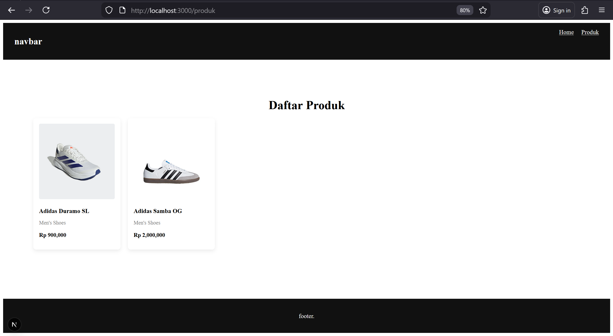
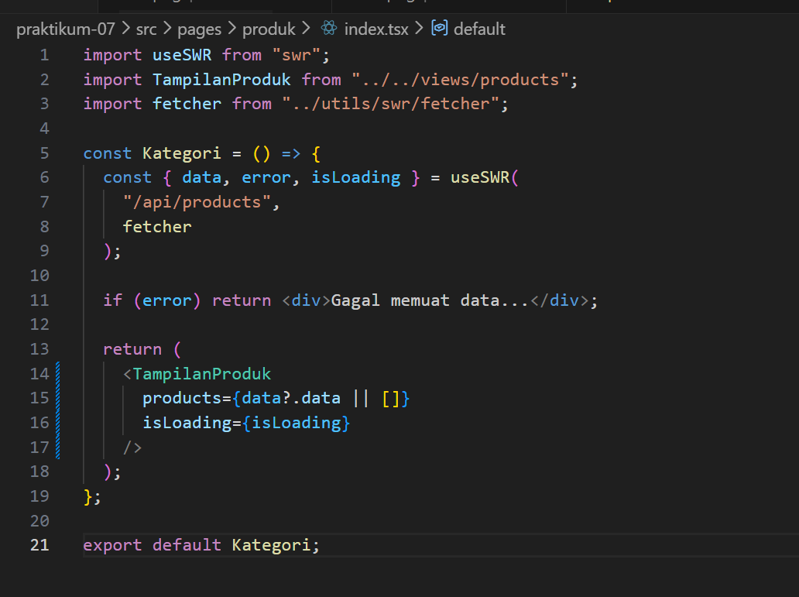
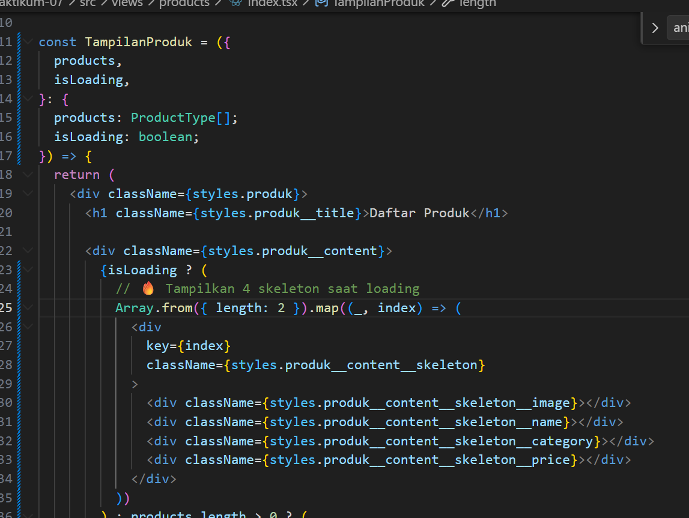
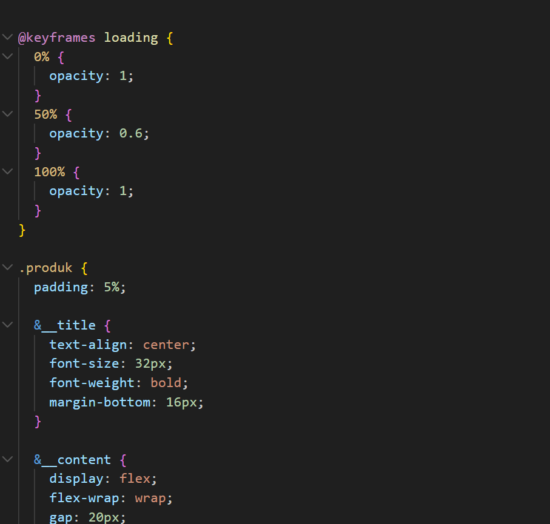
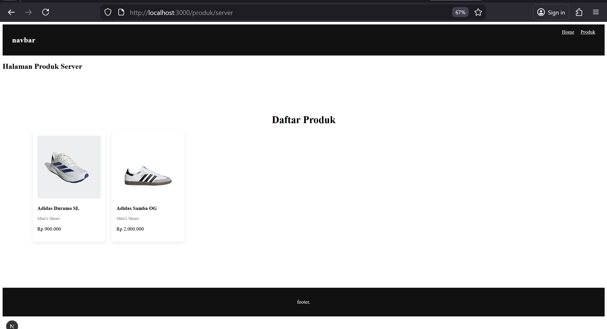
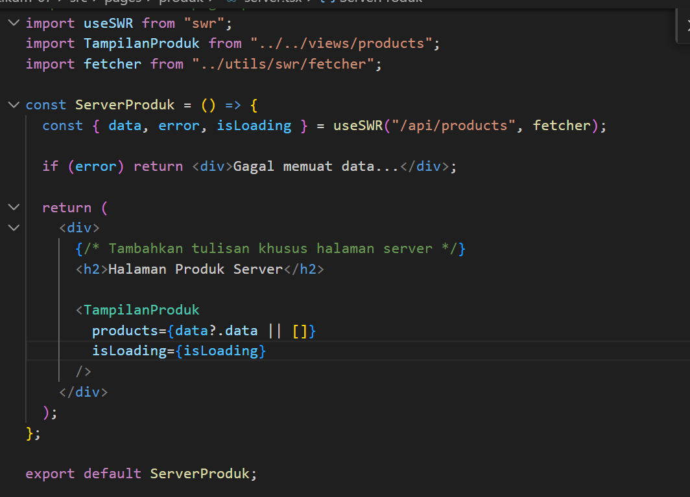

1. Setup Data Produk 

2. Implementasi CSR dengan useEffect 

3. Implementasi Skeleton Loading 

5.  Implementasi SWR  

1. Jelaskan perbedaan: 
o Client Side Rendering 
:
Client Side Rendering (CSR) adalah metode di mana halaman dirender di browser setelah file JavaScript dimuat. Server hanya mengirim HTML dasar dan proses pengambilan data dilakukan di sisi client. Cocok untuk aplikasi interaktif, tetapi kurang baik untuk SEO.
o Server Side Rendering 
:
Server Side Rendering (SSR) adalah metode di mana halaman dirender di server setiap kali ada permintaan dari pengguna. Server mengirim HTML yang sudah berisi data lengkap sehingga lebih baik untuk SEO dan data selalu terbaru, namun beban server lebih besar.
o Static Site Generation 
:
Static Site Generation (SSG) adalah metode di mana halaman dibuat saat proses build sebelum diakses pengguna. Halaman yang dihasilkan bersifat statis, sangat cepat diakses, dan baik untuk SEO, tetapi tidak cocok untuk data yang sering berubah secara real-time.

2. Tugas 2

3. Tugas 3

