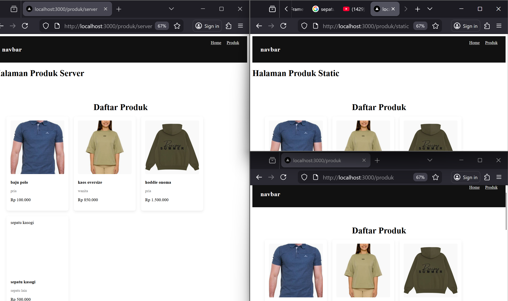
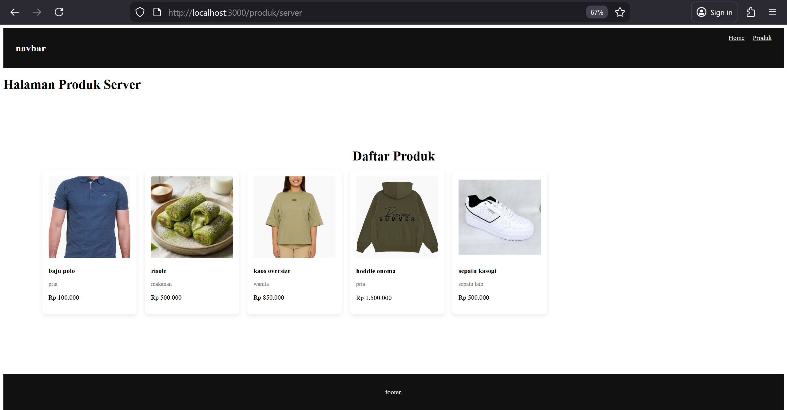

1. langkah 1 dan 2

2. Build Production Mode 

3.  Perubahan Data 

4. Tugas Individu 

 1. halamaan ssr csr ssg

 2. 

Pembahasan: Dari uji yang dilakukan pada SSG harus melakukan build dulu baru data bisa muncul, berbeda dengan SSR dan CSR.

E. Studi Analisis 
Jawab pertanyaan berikut: 
1. Mengapa SSG tidak menampilkan data terbaru? 
:
Karena data diambil saat proses build, sehingga halaman yang dibuat bersifat statis dan tidak mengambil data terbaru dari database.
2. Mengapa SSG lebih cepat? 
:
Karena halaman sudah digenerate sebelumnya saat build, sehingga server hanya perlu mengirim file HTML tanpa mengambil data lagi.
3. Kapan SSG tidak cocok digunakan? 
:
SSG tidak cocok digunakan ketika data sering berubah atau harus selalu terbaru, misalnya data stok produk atau data real-time.
4. Mengapa e-commerce tidak cocok menggunakan SSG murni? 
:
Karena data seperti harga, stok, dan produk sering berubah, sehingga jika menggunakan SSG murni data bisa menjadi tidak update.
5. Apa perbedaan build mode dan development mode? 
Development mode (npm run dev) digunakan saat pengembangan dan data dapat berubah langsung.
Build/production mode (npm run build dan npm run start) digunakan saat aplikasi dijalankan secara final dan halaman SSG benar-benar statis.
