1.  Membuat Dynamic Route 

2. Implementasi CSR (Client Rendering)  
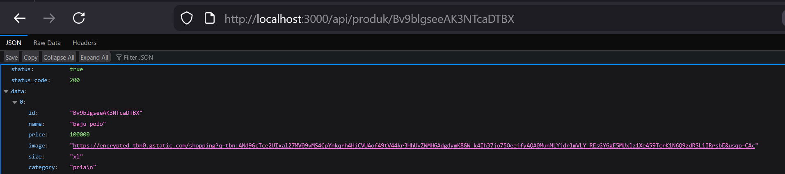
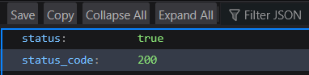
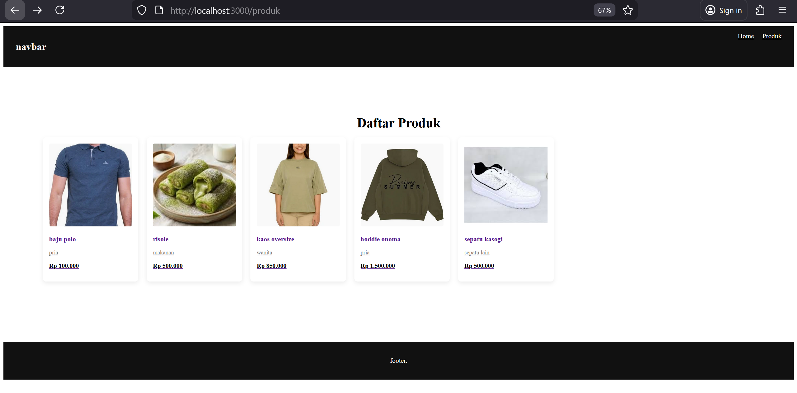
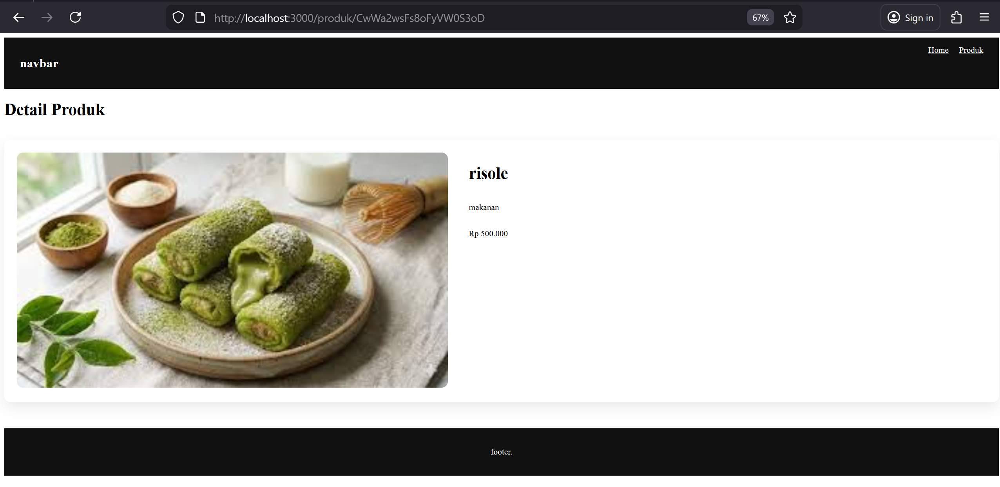
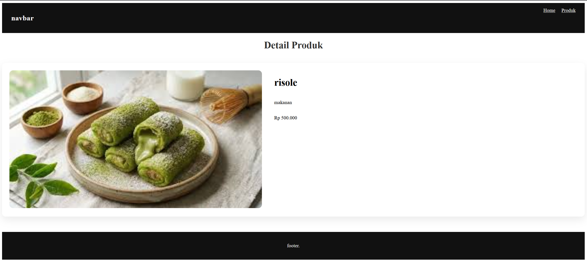

3. Implementasi SSR 
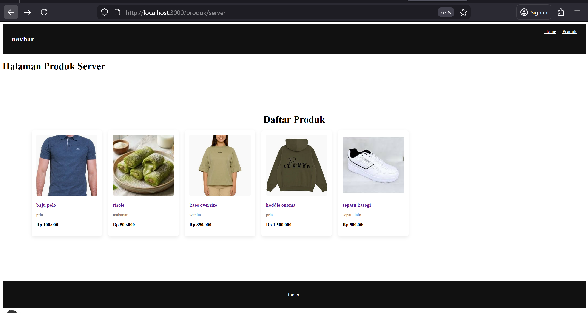
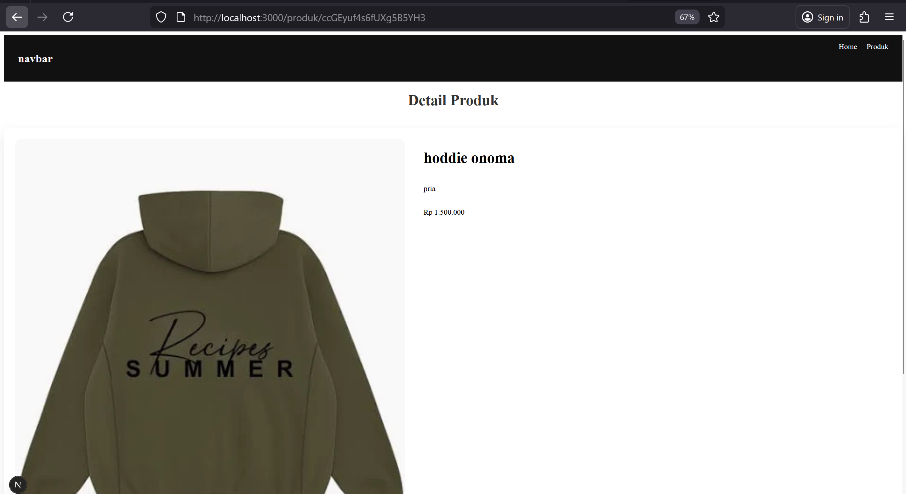
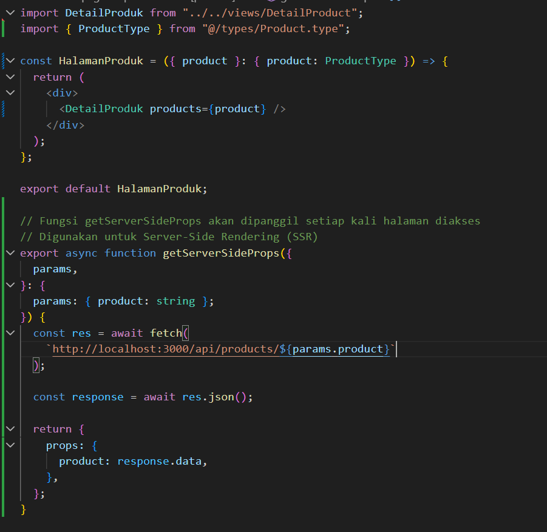

4. Implementasi Static Site Generation (Dynamic SSG) 
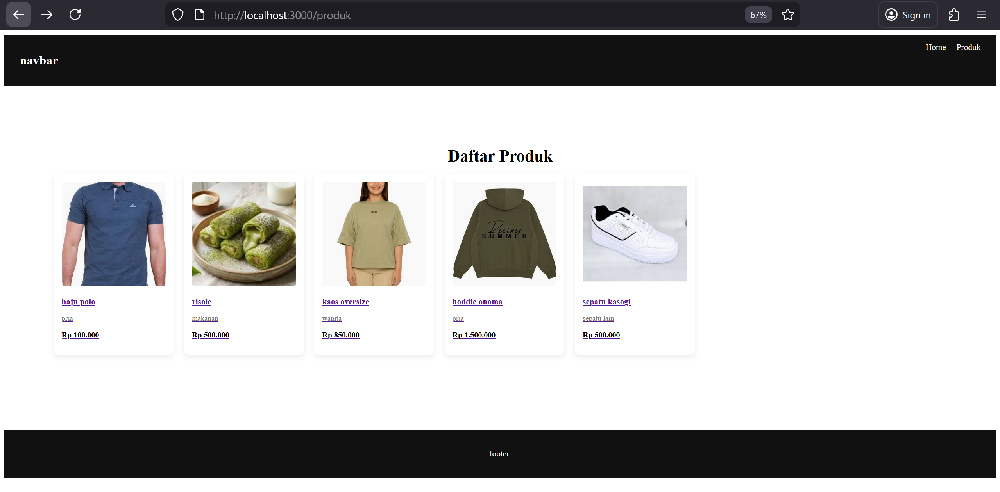
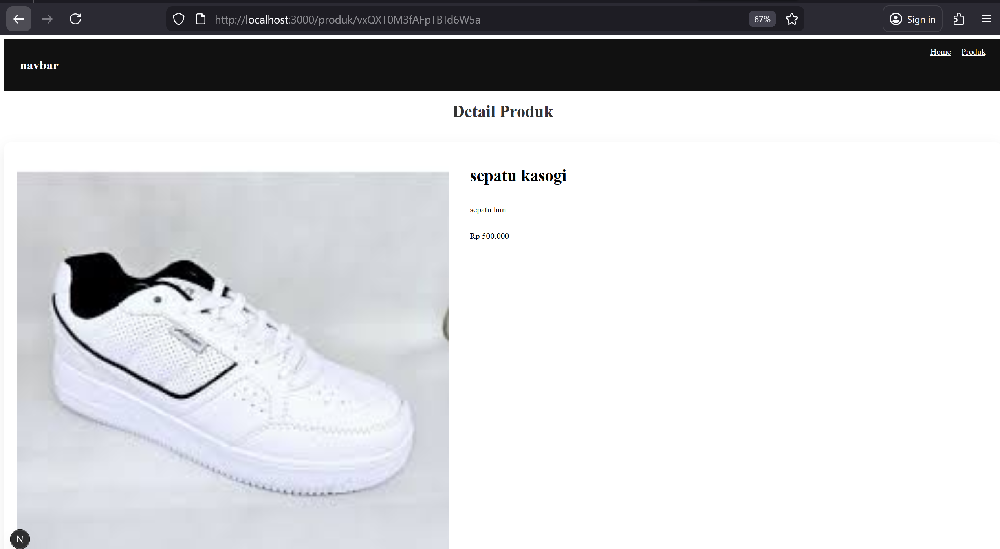
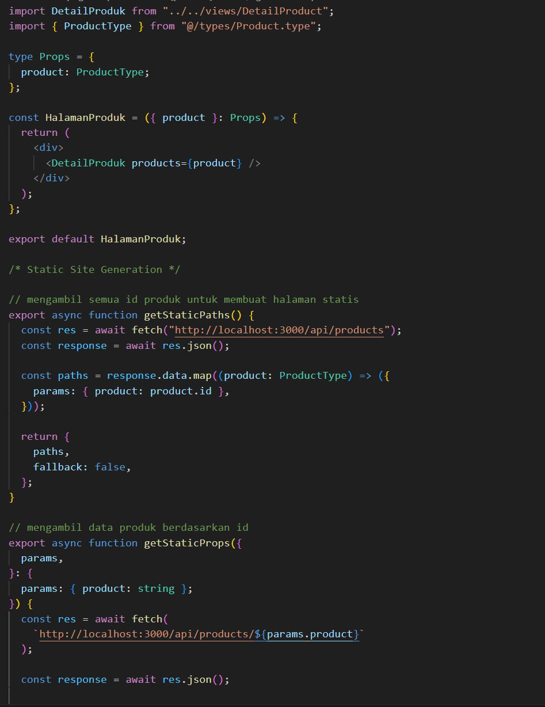
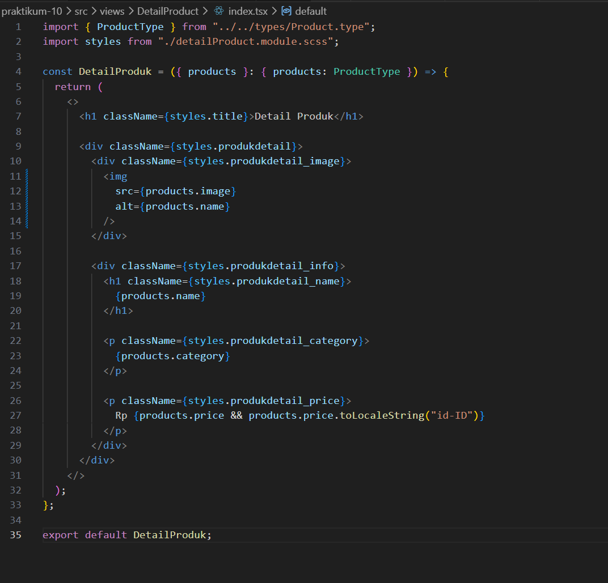

5. Tugas 

2. perbandingan: Aspek CSR SSR SSG : 
- csr 
loading : Awal agak lama karena data diambil di browser
Build : Tidak perlu build khusus untuk data
SEO : Kurang baik untuk SEO
Perubahan Data : Sangat dinamis, langsung update dari API
- ssr
loading : Cepat karena HTML sudah dirender di server
Build : Tidak perlu build ulang saat data berubah
SEO : Baik untuk SEO
Perubahan Data : Dinamis setiap request
- ssg
loading : Sangat cepat karena halaman sudah dibuat saat build
Build : Perlu build saat deploy
SEO : Sangat baik untuk SEO
Perubahan Data : Tidak langsung berubah, harus build ulang

3.  Pertanyaan Analisis 
1. Mengapa getStaticPaths wajib pada dynamic SSG? 
:
Karena Next.js perlu mengetahui path atau halaman mana saja yang harus dibuat saat proses build.
2. Mengapa CSR membutuhkan loading state? 
:
Karena data diambil dari API setelah halaman dimuat di browser, sehingga perlu indikator saat data masih dimuat.
3. Mengapa SSG tidak menampilkan produk baru tanpa build ulang? 
:
Karena halaman sudah dibuat saat proses build, sehingga data baru tidak muncul sebelum dilakukan build ulang.
4. Mana metode terbaik untuk halaman detail e-commerce? 
:
SSR, karena data produk bisa selalu terbaru dan tetap SEO friendly.
5. Apa risiko menggunakan SSG untuk produk yang sering berubah?
:
Data bisa menjadi tidak up-to-date sampai dilakukan build ulang ya