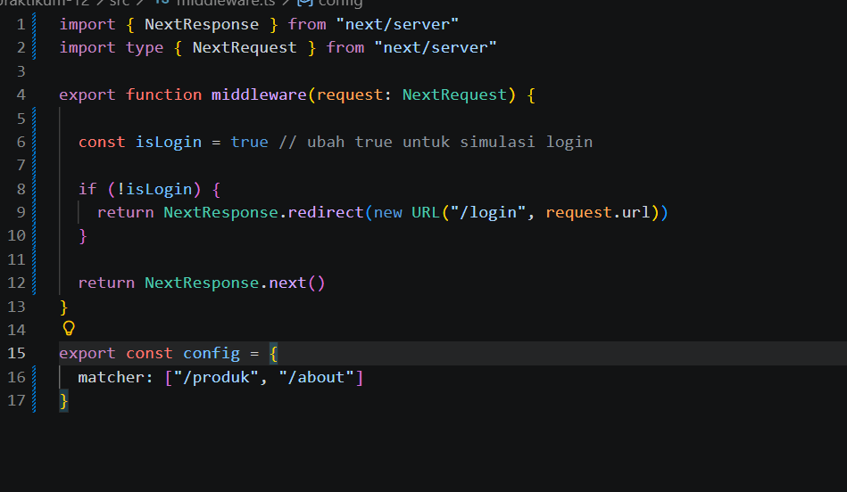

1.  Membuat Middleware 

2. Struktur Dasar Middleware 

3. Redirect Sederhana 

4. Batasi Route Tertentu 

5. Simulasi Sistem Login 

6.  uji

7. Pertanyaan Analisis 
1. Mengapa middleware lebih aman dibanding useEffect? 
:Karena middleware berjalan sebelum halaman dirender, sehingga user yang belum login tidak bisa melihat halaman sama sekali. Sedangkan useEffect berjalan setelah halaman tampil.

2. Mengapa middleware tidak menimbulkan glitch? 
:Karena redirect dilakukan sebelum halaman muncul di browser, jadi tidak terlihat perpindahan halaman secara tiba-tiba.

3. Apa risiko jika semua halaman diproteksi tanpa pengecualian? 
:User bisa tidak bisa mengakses halaman login dan terjadi redirect terus menerus (infinite loop).

4. Kapan middleware tidak diperlukan? 
:Saat website tidak membutuhkan login, tidak ada proteksi role user, atau semua halaman bersifat publik.

5. Apa perbedaan middleware dan API route?
:
Middleware :
- untuk proteksi halaman
- berjalan sebelum halaman diakses
- contoh: cek login

API Route :
- untuk proses data backend
- berjalan saat endpoint dipanggil
- contoh: ambil data dari database

