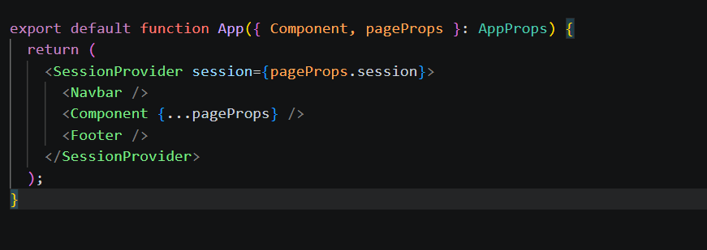
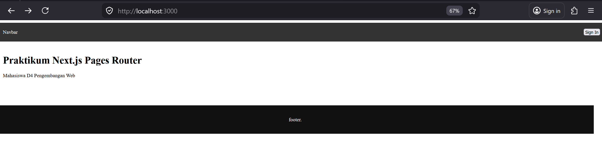
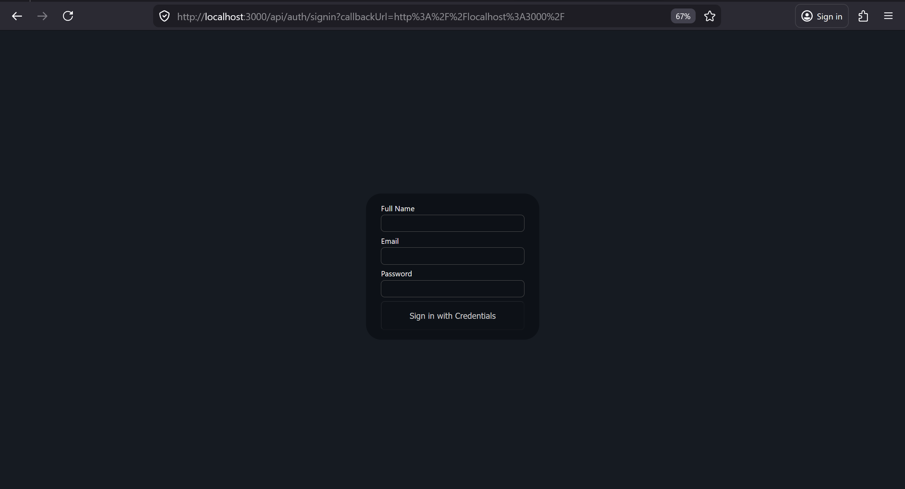
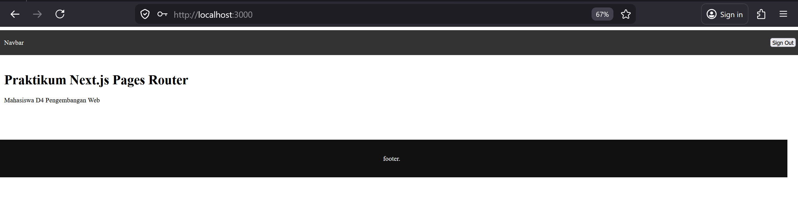
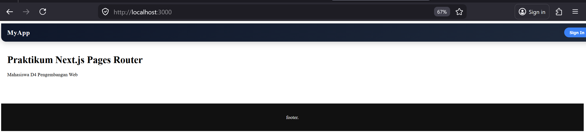
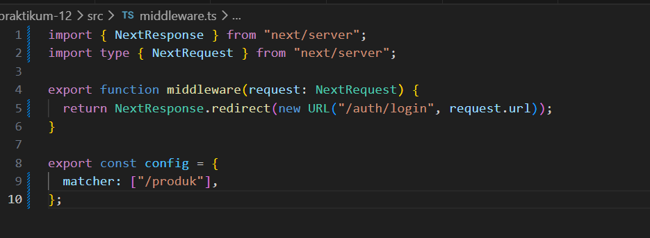
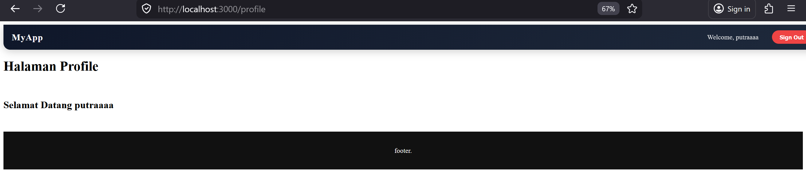

1. Install NextAuth 

2. Konfigurasi API Auth  

3. Tambahkan Secret  

4. Tambahkan SessionProvider   

5. Tambahkan Tombol Login & Logout  

6. Menambahkan Data Tambahan (Full Name) 

7. Proteksi Halaman Profile 

