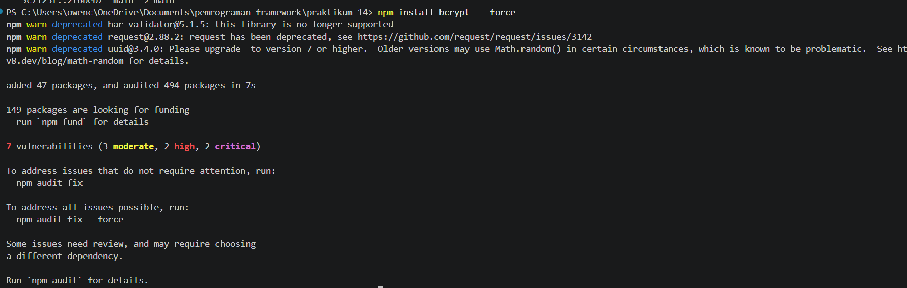
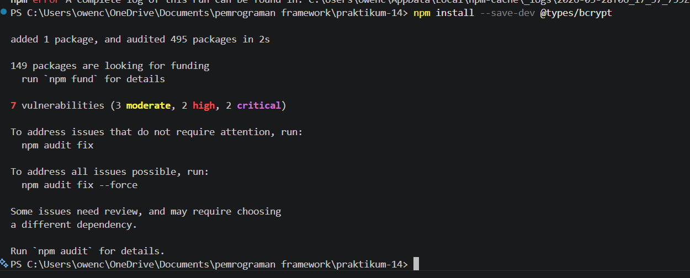
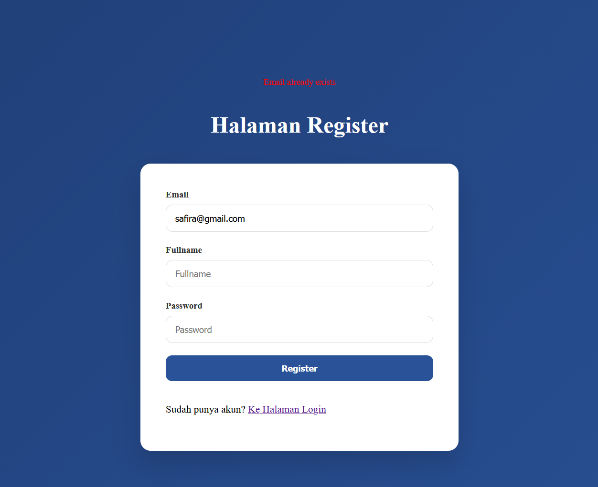
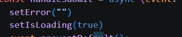
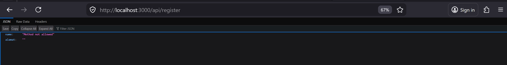

1.  Membuat Register View 

2. Membuat API Register 

3.  Install bcrypt  

4. Uji 1

5.  Uji 2 

6. Uji 3

7.  Tugas Praktikum 

8. Pertanyaan Analisis

1. Mengapa password harus di-hash? 
: Agar password tidak disimpan dalam bentuk asli → lebih aman jika database bocor.

2. Apa perbedaan addDoc dan setDoc? 
:
addDoc → ID otomatis dari Firestore
setDoc → ID ditentukan sendiri
3. Mengapa perlu validasi method POST? 
:Agar API hanya menerima request yang sesuai (lebih aman & terkontrol).

4. Apa risiko jika email tidak dicek unik? 
:Bisa terjadi akun ganda → login error, data bentrok.

5. Apa fungsi role pada user? 
:Untuk membedakan hak akses (misal: admin vs member).