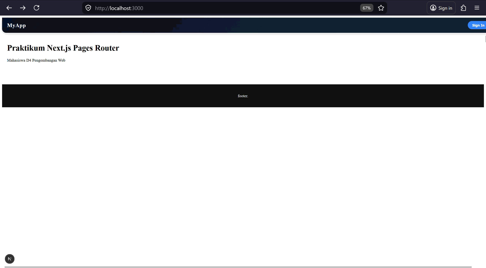
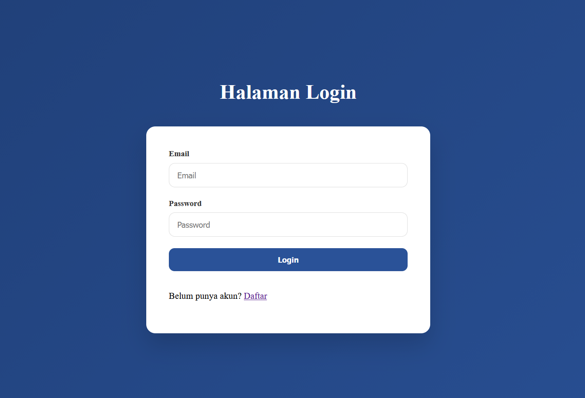
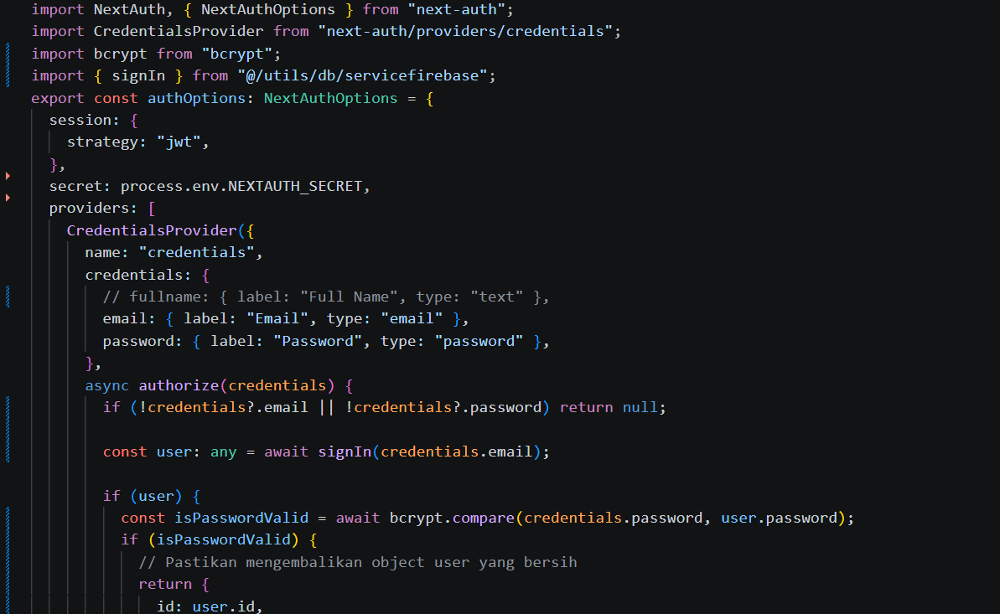
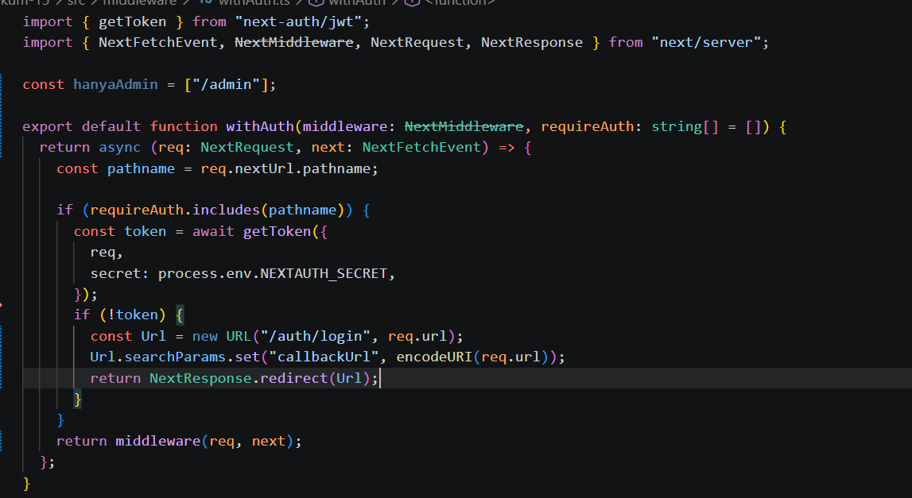
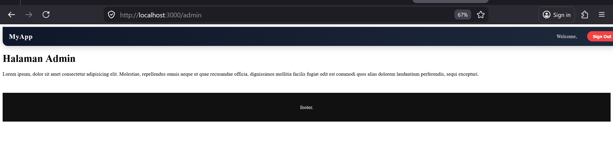

1. Custom Login Page 

2. Handle Login di Frontend  

3. Authorize di NextAuth (Database Login) 

4. Tambahkan Role ke Token 

5. Callback URL Logic 

6.  Membuat halaman Admin dan authoriz 

7. Pengujian 
