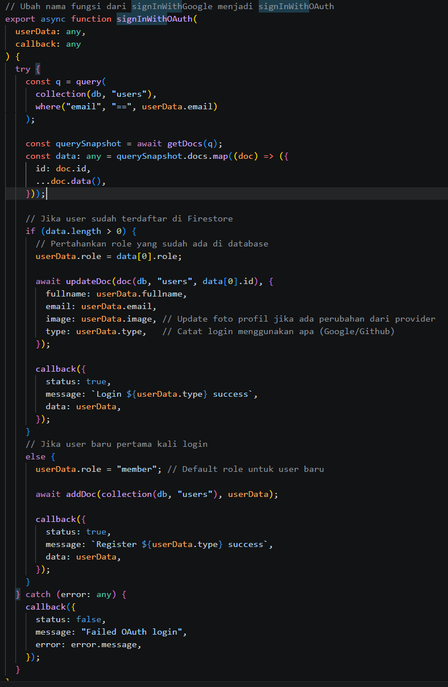
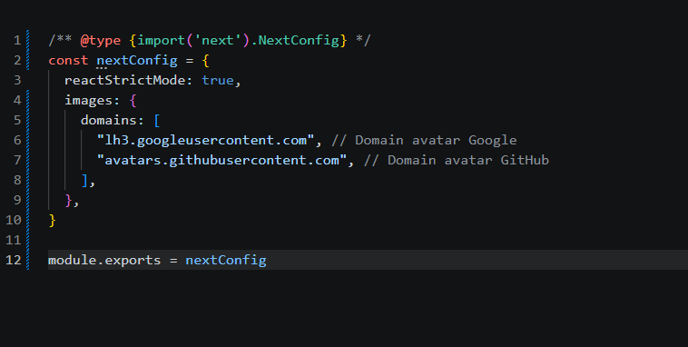

1. Masuk ke Google Cloud Console 

2. Buat Project Baru 

3. Konfigurasi OAuth Consent Screen 

4. Buat OAuth Credentials 

5. Tambahkan Environment Variables

6.  Konfigurasi Google Provider di NextAuth dan Handle Callback JWT & Session 

7. Tambahkan Button Login Google 

8. Simpan Data Google ke Database 

9. Pengujian

10. diskusi dan analisis
1. Apa perbedaan login credential dan login Google? 
:Credentials: user login pakai email + password yang disimpan di database. 
Google: user login lewat akun Google tanpa perlu membuat password baru.

2. Mengapa data Google tetap perlu disimpan ke database? 
:menyimpan role (admin/member)
menyimpan profil user
mengatur akses fitur
Tanpa database, kita tidak bisa mengatur hak akses.

3. Apa fungsi JWT callback? 
:Untuk menyimpan data penting user (email, role, dll) ke token session sehingga bisa digunakan di seluruh aplikasi tanpa query database berulang.

4. Mengapa perlu multi-role? 
:admin → bisa kelola data
member → hanya melihat data

5. Apa risiko jika tidak menyimpan user ke database? 
: 5️⃣ Risiko jika tidak menyimpan user ke database

tidak bisa mengatur role
tidak bisa menyimpan profil
sulit melacak user
akses fitur tidak bisa dibatasi

11. Tugas Mandiri

