1. Masuk ke Google Cloud Console 

2. Buat Project Baru 

3. Konfigurasi OAuth Consent Screen 
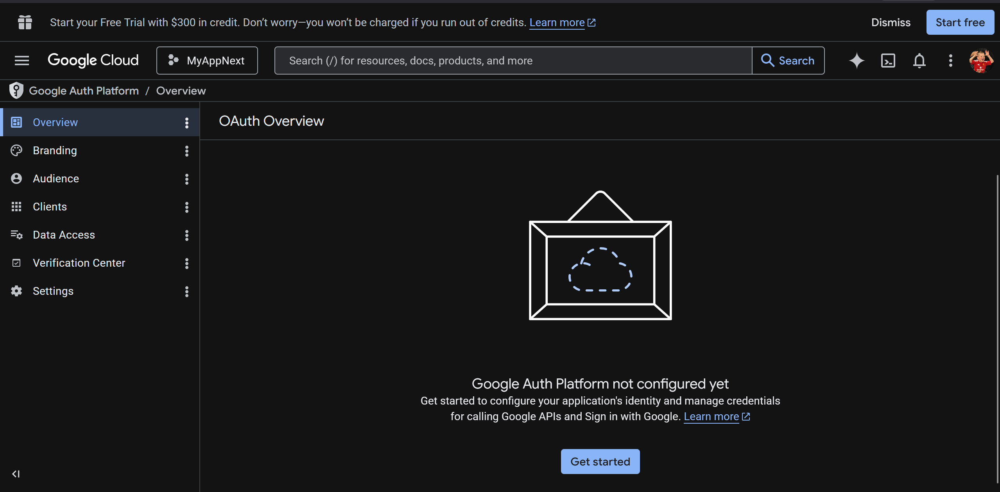
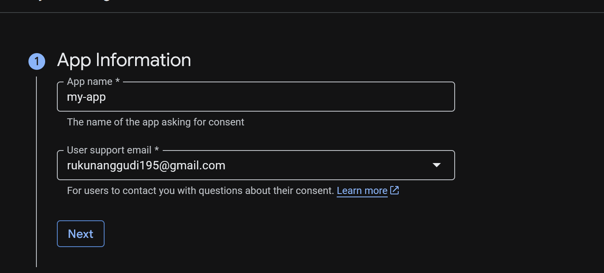
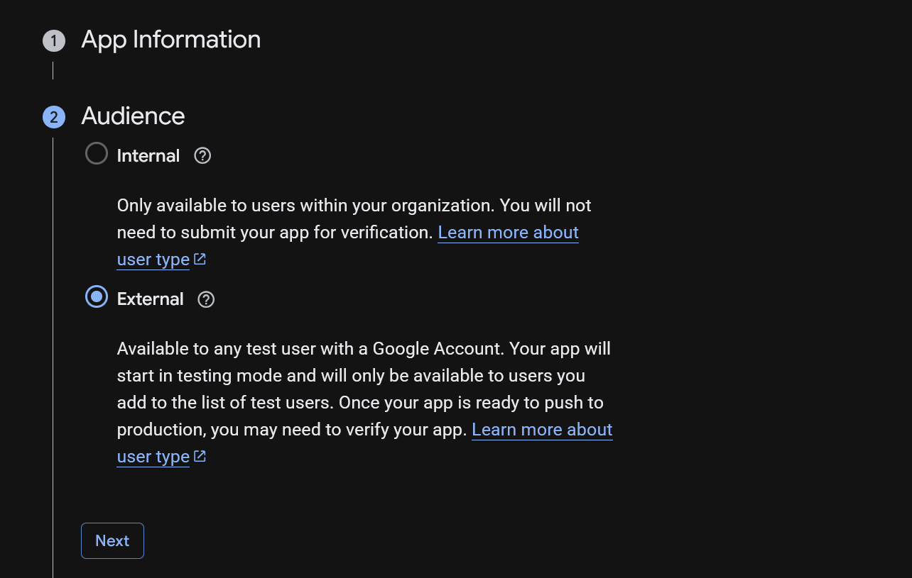
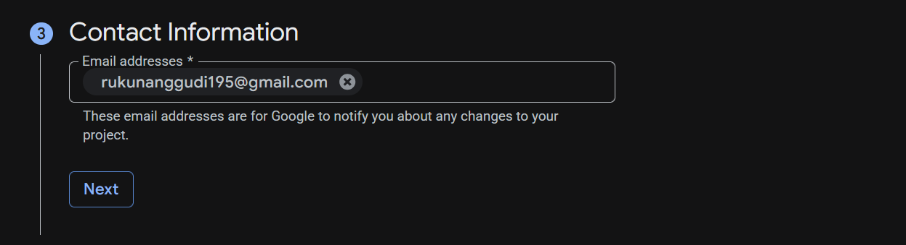
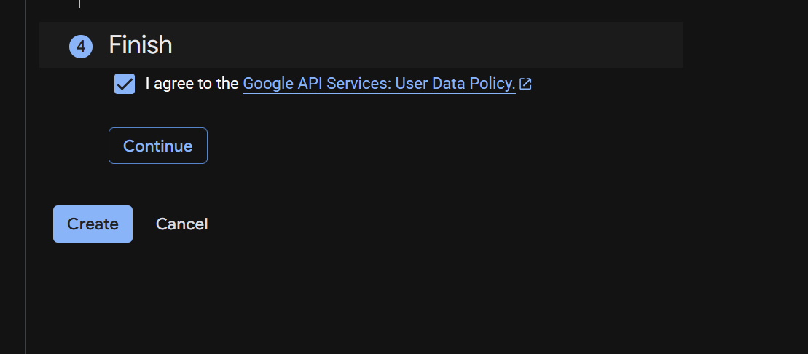

4. Buat OAuth Credentials 
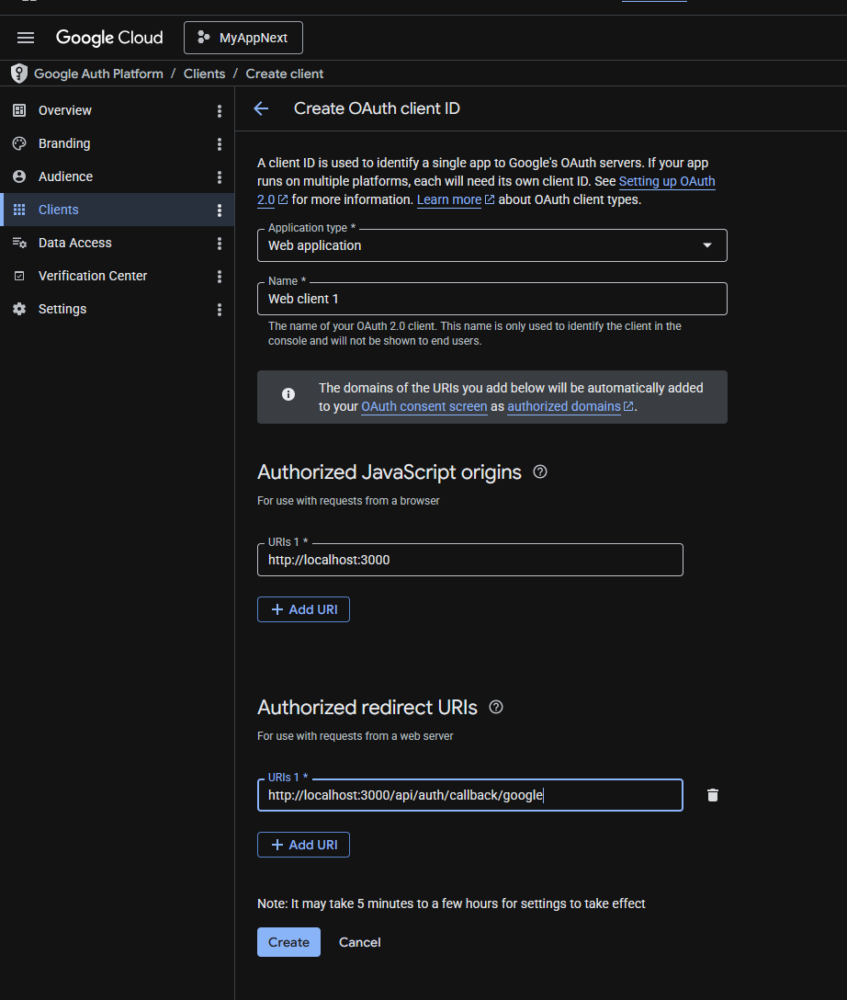

5. Tambahkan Environment Variables
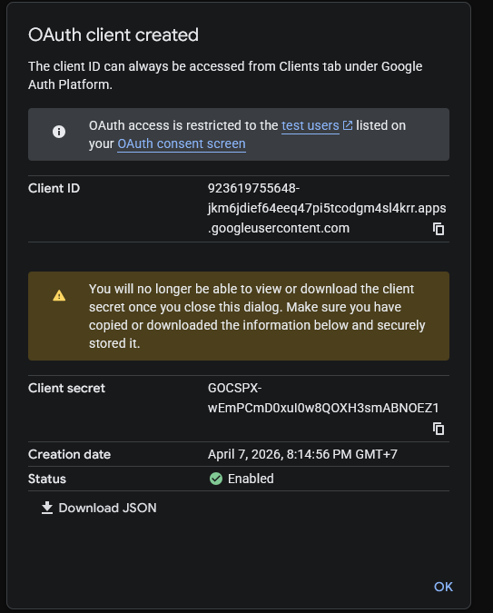
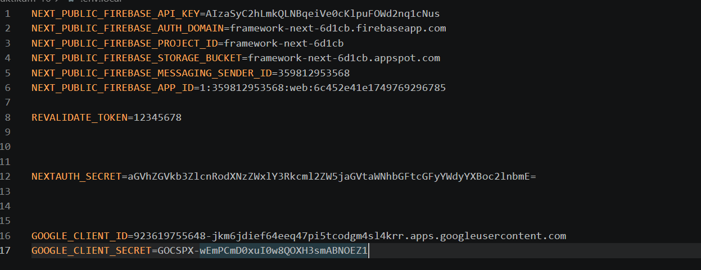

6.  Konfigurasi Google Provider di NextAuth dan Handle Callback JWT & Session 
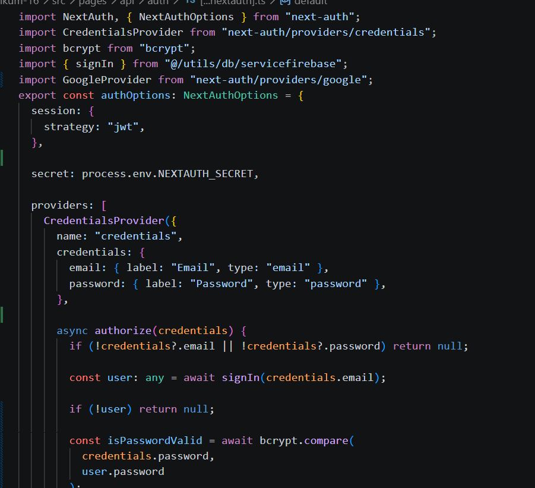

7. Tambahkan Button Login Google 
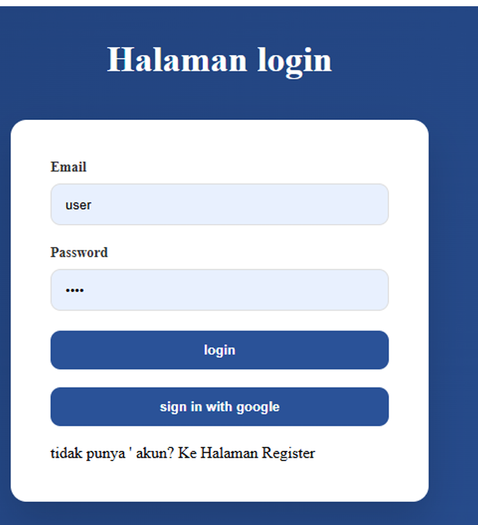
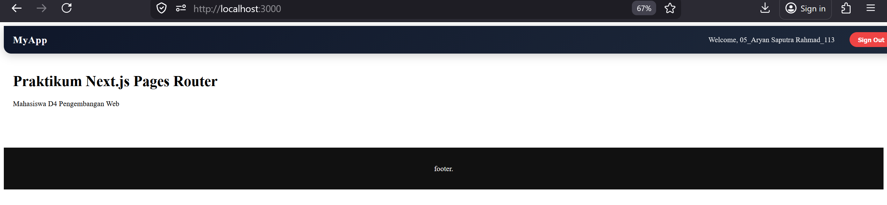
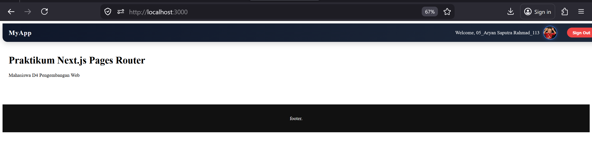

8. Simpan Data Google ke Database 
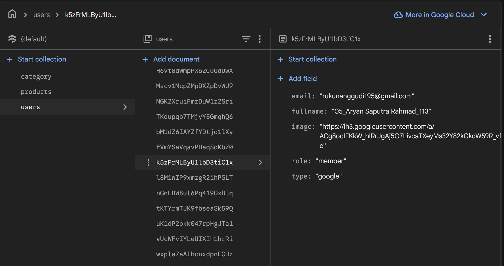

9. Pengujian

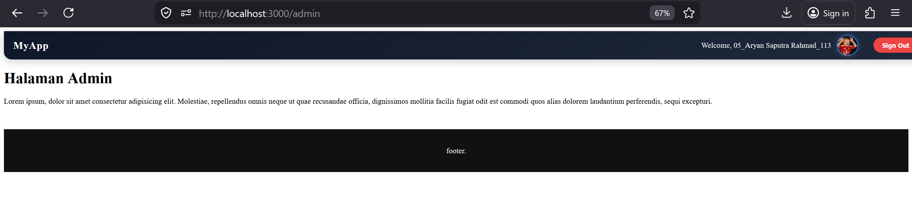