1. Setup Jest di Next.js 
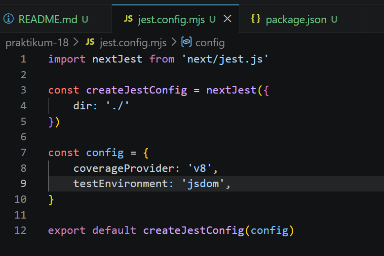
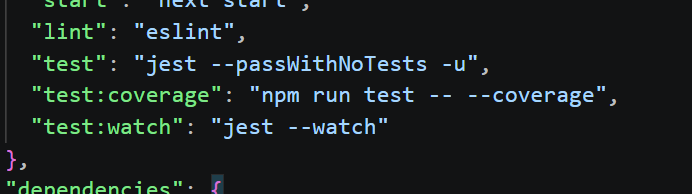

2.  Struktur Folder Testing 
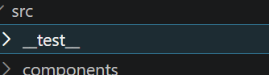

3. Testing Halaman About 
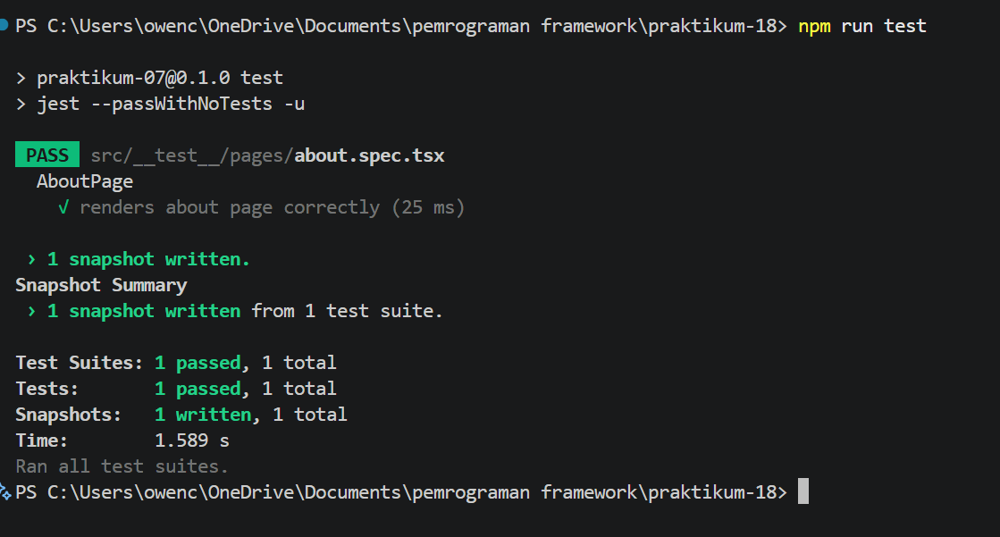

4.  Coverage Report 
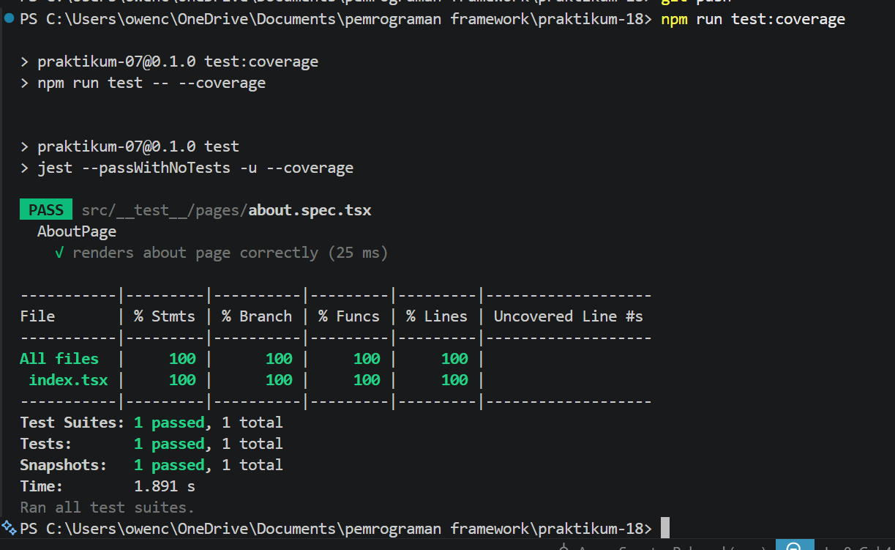
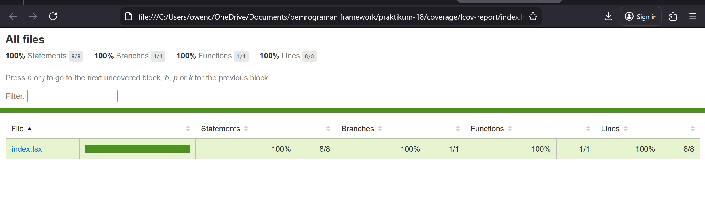

5. Konfigurasi Coverage Lengkap
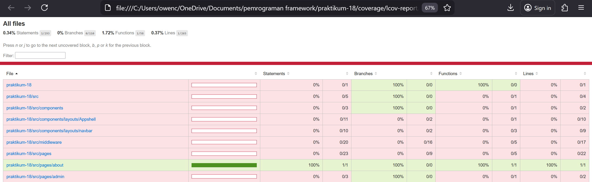

6. Testing dengan getByTestId 
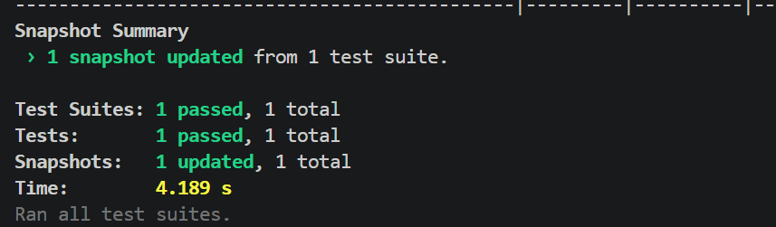
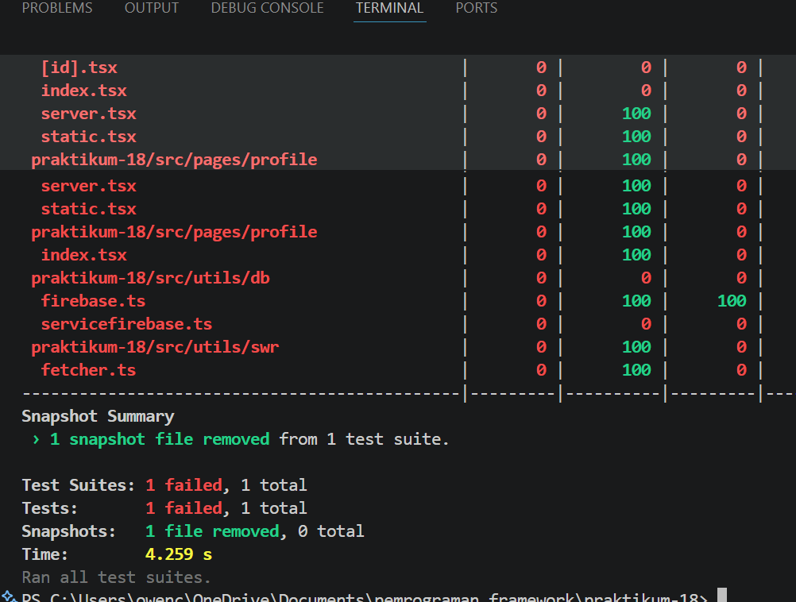

7. Testing Page dengan Router (Mocking)
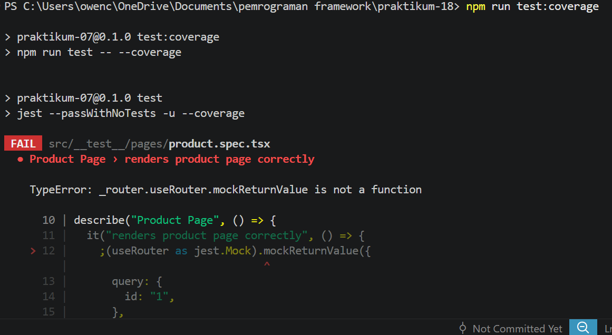
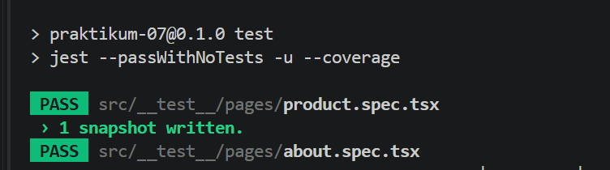

8. Menangani Undefined Data 
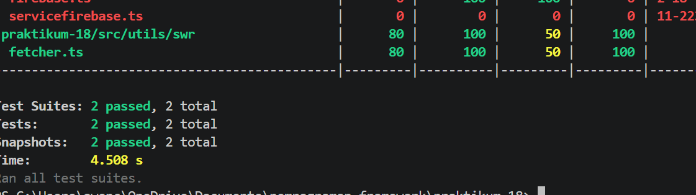