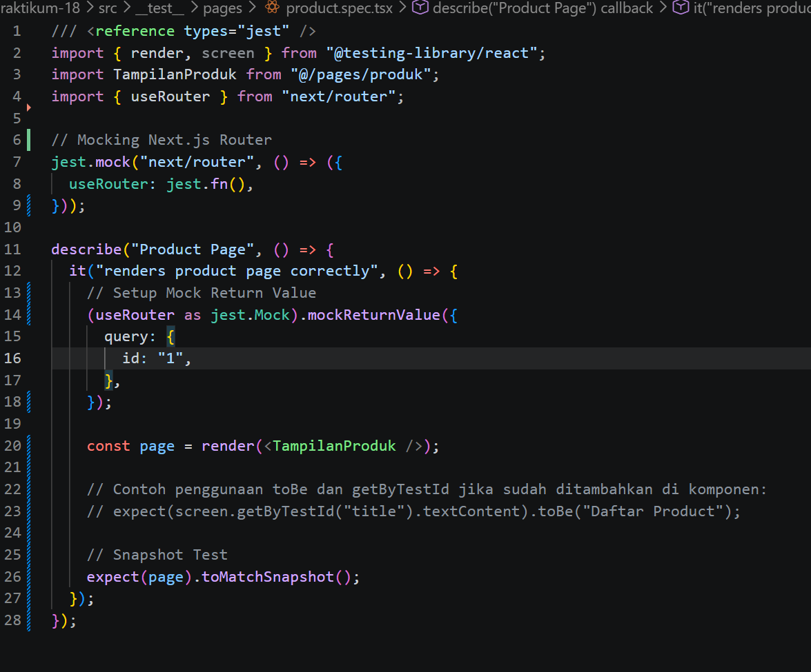
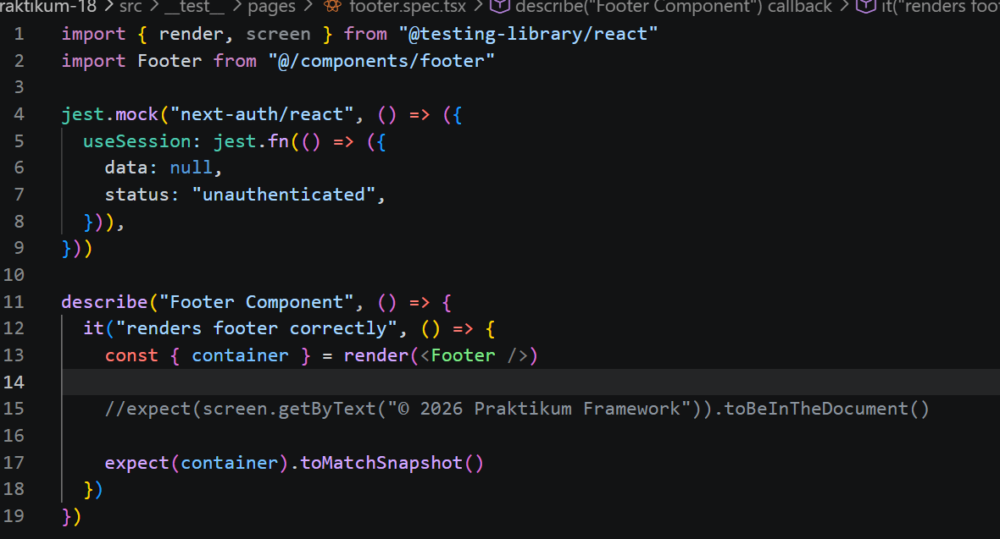
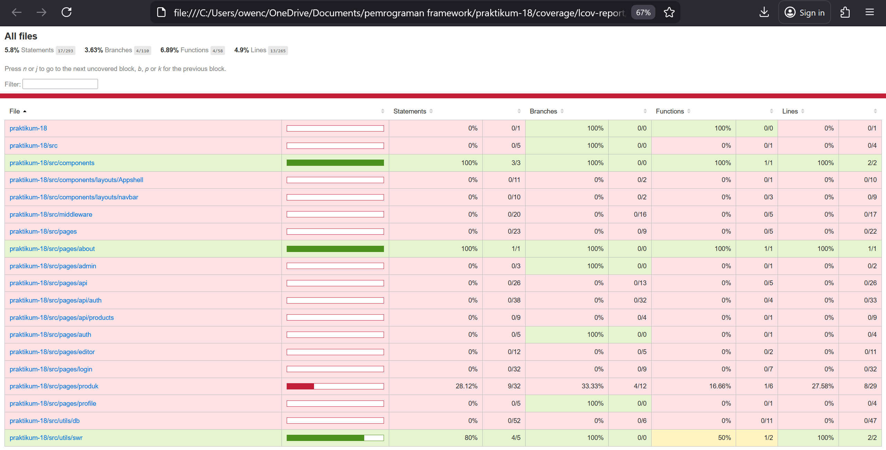
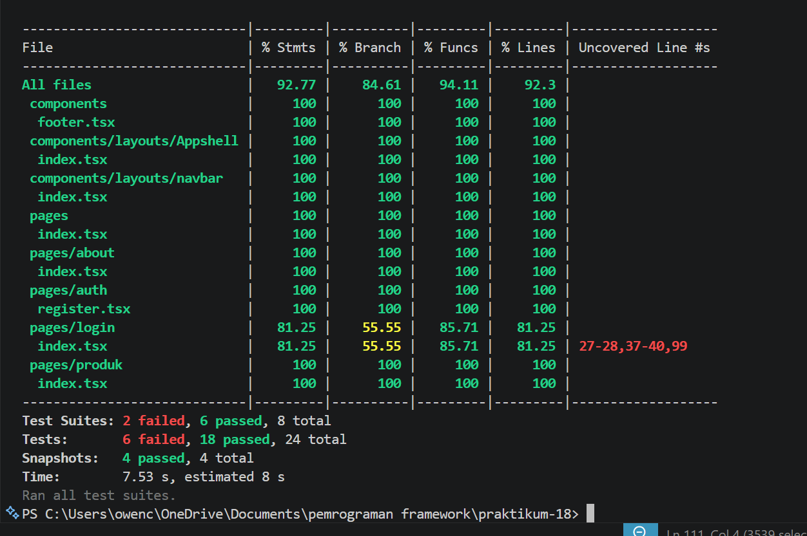
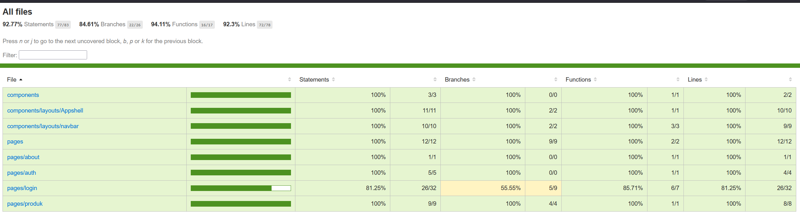

1. Setup Jest di Next.js 

2.  Struktur Folder Testing 

3. Testing Halaman About 

4.  Coverage Report 

5. Konfigurasi Coverage Lengkap

6. Testing dengan getByTestId 

7. Testing Page dengan Router (Mocking)

8. Menangani Undefined Data 

9. Tugas Praktikum

10. Diskusi & Refleksi 
1. Mengapa unit testing penting sebelum production? 
:Unit testing penting agar bug terdeteksi lebih awal sebelum ke production.

2. Mengapa branch coverage sulit mencapai 100%? 
:Branch coverage sulit 100% karena banyak kondisi edge case yang jarang terjadi.

3. Apa itu mocking? 
:Mocking adalah teknik meniru dependency (API, DB, dll) agar test bisa berjalan tanpa resource asli.

4. Kapan snapshot test digunakan? 
:Snapshot test digunakan untuk mengecek perubahan tampilan UI agar tidak berubah tanpa sengaja.

5. Apakah semua file harus dites? 
:Tidak semua file harus dites, fokus pada logic penting dan fitur utama.

